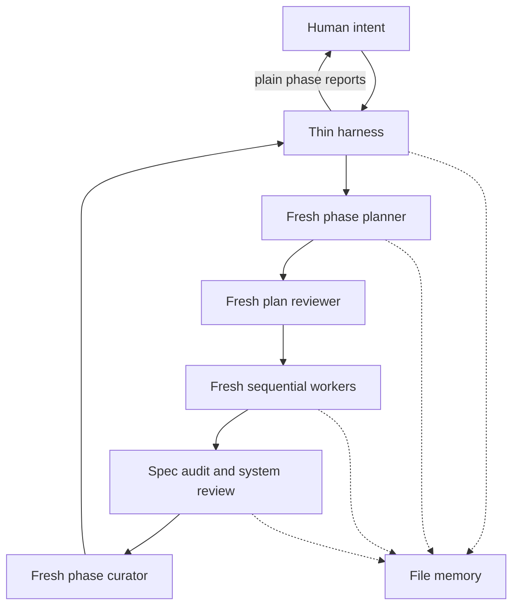

# oplan v0.2 — design

**Status:** v0.2 amendment approved 2026-08-11. This supersedes v0.1 where they conflict.

## Goal

Plan and execute substantial multi-phase software work while:

- keeping the main thread a thin orchestration harness;
- using a fresh strong planner for every phase, including Phase 1;
- using isolated inexpensive agents for leaf implementation;
- continuing automatically across successful phase boundaries;
- preserving all durable truth in files;
- keeping the human oriented without blocking routine progress;
- escalating material unresolved design questions through optional `grill-me`.

## Non-goals

- No unstructured swarm or parallel product writers.
- No custom VCS for hundreds of concurrent agents.
- No agent-to-agent negotiation or inherited chat histories.
- No mandatory interrogation at every phase.
- No replacement for a normal single-agent workflow on small tasks.

## Evidence and what oplan adopts

The primary influence is Cursor's 2026 report
[Agent swarms and the new model economics](https://cursor.com/blog/agent-swarm-model-economics).

| Cursor finding | oplan v0.2 consequence |
|---|---|
| Large tasks naturally form trees | A phase planner recursively decomposes work until sealed leaf packets fit one worker context |
| Planners never implement; workers never plan | The main thread is neither; every phase uses a fresh planner and every leaf a fresh worker |
| Context efficiency matters more than parallelism | Product writes stay sequential; the harness receives capped reports and artifact paths |
| Split-brain comes from duplicated design ownership | Decisions receive stable `D-###` IDs; no two leaves may own the same question |
| Shared design docs reconcile pictures of reality | Packets reference decision IDs; amendments force replanning of affected descendants |
| Decorrelated review lenses stack | Narrow spec audit plus a codebase/system lens for high-risk work and every phase gate |
| Field Guides capture surprising encounters | A 40-line curated guide is injected into planners/workers, not the narrow auditor |
| Megafiles become coordination hotspots | Workers flag structural hotspots; a planner creates a separate reviewed decomposition leaf |
| Fear of core changes causes ossification | Workers may submit a core-change proposal but cannot exceed packet scope; planners formalize it |
| Strong-planner/cheap-worker mixes can save dramatically | Use capability tiers, but optimize total run cost rather than assuming the strongest planner wins |
| Specs are the new unit of work | Treat intent→design→tree→packet→code as probabilistic compilation with checks at each lowering |
| File memory must carry operational truth | Small controls, reviewed hashes, exact Git bases, versioned attempts, and total transitions make replacement of the harness executable |

Cursor reported similar final quality across model mixes but costs from roughly $1,339 to $10,565;
workers carried at least 69% of tokens and usually over 90%. It also found that a more expensive
planner could consume fewer planning tokens yet trigger more downstream worker tokens. Therefore
oplan records cost and quality by role and tunes from completed-task evidence.

Other retained influences:

- Cognition: keep writes single-threaded; fresh reviewers catch context-rot defects; weak workers
  should not control escalation.
- Anthropic: delegation needs explicit objectives, boundaries, and exclusions.
- AgentCARD: mixed-model teams can improve cost/accuracy, but the bottleneck role is task-dependent.

## Architecture

The harness executes a state machine. It reads only small state/phase/leaf controls, seals, and capped reports,
runs mechanical gates from small reviewed leaf controls, updates records, commits accepted leaves,
and narrates progress. It never creates a feature plan or product code. A total verdict table
defines candidate treatment and the next action for every role output.

## Planning and decision ownership

Use the same fresh-planner path for all phases. Later phases begin as sketches and are expanded
only when preceding evidence exists.

Every leaf has:

- a single goal and exhaustive write set;
- commands and frozen mechanical validation;
- dependent `D-###` decisions and contracts;
- explicit non-goals and dependencies;
- risk classification and bounded budgets;
- a sealed report contract.
- a machine JSON control record containing only write set, validation, risk, and decision IDs;
- an immutable post-review SHA-256 seal covering packet and control record.

The active phase control carries dispatch order, phase acceptance, final overall acceptance, and
the next-phase identity. A pre/post worktree snapshot rejects any executor change outside the
declared write set. Every capped role return is persisted before its verdict changes state.

The planner resolves implementation choices inside approved intent. It returns only repository
facts, material product decisions, and authority questions as blockers.

A verified full Git commit anchors the first diff. Pre-existing dirty paths are protected rather
than silently committed or reset. A fresh boundary curator reconciles evidence and later sketches
before every phase close, including the final phase.

## Optional grill gate

At any planning boundary—including Phase 1—classify blockers:

1. researchable fact → fresh research agent;
2. implementation choice → planner decides and records `D-###`;
3. material product/scope/UX/acceptance trade-off → invoke installed `grill-me`, or fallback;
4. permission/destructive/external authority → ask the human directly.

`grill-me` asks one question at a time with a recommended answer and inspects the codebase instead
of asking researchable questions. After resolution, discard the old planner and start a fresh one.

## Verification

1. **Leaf gate:** harness reruns the frozen validation and stores full logs on disk.
2. **Spec lens:** fresh auditor checks sealed packet against scoped diff only.
3. **System lens:** fresh reviewer checks integration and accumulated structure after high-risk
   leaves and at every phase gate.
4. **Phase gate:** held-out acceptance criteria, written before leaf execution, test the outcome.
5. **Seal gate:** packet and machine control hashes are verified before dispatch, retry, review,
   and commit.
6. **Scope gate:** worktree state before/after execution proves there is no undeclared product or
   orchestration-file change.

No role certifies its own output. Review findings become new planned repair leaves.

## Human loop

Before every phase, show what/why/steps/done-when/risk. In autonomous mode, continue immediately.
After every phase, show actual work, discoveries, failures and repairs, design changes, structural
flags, gate results, remaining risks, and the next action.

Stop only in `COMPLETE`, `BLOCKED`, or `AWAITING_HUMAN_DECISION`. A phase close is not terminal.

## Context and recovery

The main thread cannot literally erase itself in every harness. v0.2 therefore keeps it thin:

- no full plans, journals, code, diffs, or transcripts enter main context;
- validation logs go to disk and the harness receives an exit code plus short tail;
- planners/reviewers/workers use fresh non-inherited contexts;
- `phase-state.md` always names one executable `NEXT_ACTION`;
- human questions and research facts live in named blocker/evidence artifacts before the run waits;
- versioned attempt artifacts preserve reports and independent retry/mismatch counts;
- file memory supports replacement of the main process when a host can provide it.

## Metrics and kill criterion

Record first-pass rate, retries, escalations, interventions, cost by role, scope/decision conflicts,
structural flags, repair leaves, churn warnings, and harness context size when available.

Compare the harness against a plain strong-agent baseline on real work. Keep mechanisms that reduce
bugs, interventions, or total cost. Shrink mechanisms that do not earn their coordination cost.
Do not use commit count or raw token volume as a productivity target.

## Test ladder

1. Contract validator: cross-file hard rules and resource presence.
2. Paper test: fresh role-by-role conformance review.
3. Three-phase smoke test: autonomous continuation and thin-main evidence.
4. Fire drill: ambiguity, audit, system lens, process kill/resume, and bounded cost.
5. Real run: compare outcome and economics with a simpler baseline.
