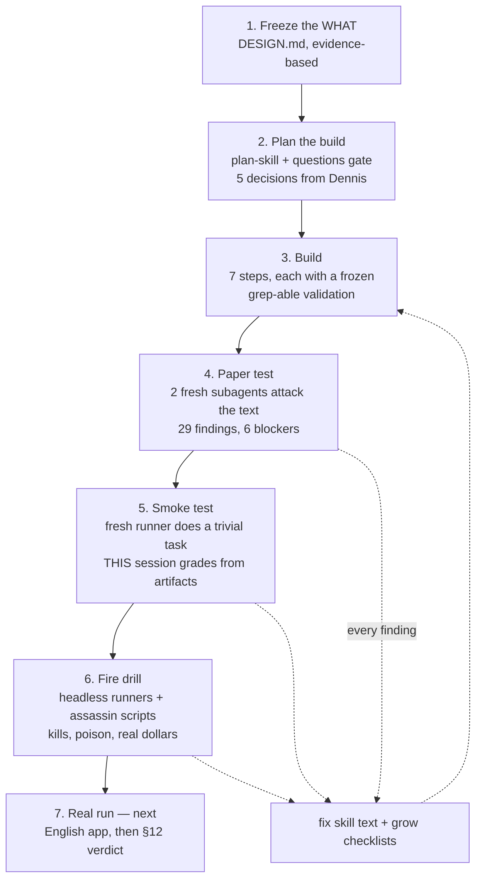

# How this skill was planned, built, and audited

> **v0.2 note (2026-08-11):** this document records how v0.1 was built. The current architecture
> is defined by `DESIGN.md` and `oplan/SKILL.md`. v0.2 replaces the default phase-boundary pause,
> main-thread Phase 1 planning, and external-only design interrogation with a thin autonomous
> harness, fresh planners for every phase, and an optional material-decision grill gate.

> The method record — written 2026-07-23, the day the whole thing happened. If a future project
> wants to build something the same careful way, this is the recipe. Simple-explainer style on
> purpose (see DESIGN.md §16).

## The one idea underneath everything

**Nobody grades their own homework.** Every stage below has a *maker* and a *separate, fresh-eyed
checker*, and the checker only ever looks at artifacts (files, commits, bytes) — never at the
maker's story about them. Every lesson found gets folded back into the skill text or a test
checklist the same day, so nothing is learned twice.

## Stage by stage — what was done and what it caught

### 1. Design frozen first (before this repo's build session)
DESIGN.md written from published evidence (Cursor, Anthropic, Cognition, AgentCARD), with
non-goals, a kill criterion (§12), and exactly five open questions. Frozen means frozen: during
the build, a real conflict with the design was escalated to Dennis (the plan.md fifth file),
ratified, and recorded as a marked amendment — never silently patched.

### 2. Planning with a questions gate
The build ran under the existing plan-skill. The five §15 questions were asked **one at a time**
(name=oplan · report format+30-line cap · 40-line soft-cap field guide · tier table with
Opus/Sonnet binding · $10 drill ceiling). One question was challenged by Dennis mid-gate
("how sure are you about 40?") — honest answer: it's a guess, so it was made *tunable and
measured* instead of frozen. The plan itself: 7 steps, each with a mechanical validation
(exact-string greps pinning the frozen contracts), saved to `plans/` before execution.

### 3. Build with frozen validations
Each artifact's must-contain strings were declared in the plan **before** writing, then grepped
after. The report contract was verified byte-identical between SKILL.md and the executor template
with `diff`, not by eye. Every step committed separately. (Two slips: validation counts written
into the log in the same command that produced them — caught, corrected, and turned into a
plan-skill rule fix: "never log a number you didn't read.")

### 4. Paper test — fresh eyes attack the text
Two parallel fresh-context subagents, different lenses: one **role-played every role** ("could I
actually execute this with only what my role is given?"), one **checked conformance against
DESIGN.md** section by section. Result: 29 findings, 6 blockers — the worst being that the plan
itself wasn't a file (breaking the design's own crash-only rule). The second lens found 3 findings
the first missed; diversity paid. All fixes applied, all contract greps re-run after.

### 5. Smoke test — separate runner, separate grader
A fresh session (different window, knowing nothing) ran the skill on a trivial 2-phase task.
THIS session graded — **only from artifacts**: bytes via xxd, commits, journal, phase-state. Rule
learned and kept: the runner's self-report is never evidence. Result: PASS, plus 3 skill fixes
(STATUS rewrite at phase gate; totals computed by command; vendor the skill into the workspace).
Actual cost $8.54 — which also disproved the grader's own hand-made "$7.4 upper bound":
**never hand-convert tokens to dollars; use ai-cost.**

### 6. Fire drill — automated sabotage
Round 1 (human springs traps by hand) failed operationally — two-window timing — and was recorded
as a drill-procedure lesson, not hidden. Round 2 automated the sabotage: the runner became a
headless child process (`claude -p`, sandboxed, PID known from birth), and dumb watcher scripts
killed it on schedule — triggered by **commit messages** (a frozen contract), not by phrases
(round 1's watcher died guessing phrasing). Poison was injected at a resume boundary. Grading
again from artifacts + ai-cost for billing-grade dollars.

**Results:** two brutal kills survived from files alone (one before the record was even
committed); poison handled as formal, reviewed change-control; ambiguity trap disarmed twice by
the planner (good §4.2 behavior; note — the executor STOP rule is still untested in anger);
**cost ceiling FAILED: $11.73 vs $10** (≈$6 = crash tax), recorded as a FAIL, not excused.

## The cross-run signal (the §12 evidence collected so far)

| Mechanism | Verdict after 3 runs |
|---|---|
| Cheap workers from complete specs | 10/10 first-try, 0 escalations — thesis holds |
| Crash-safe file record | 2/2 brutal kills survived — the core promise is real |
| Plan reviewer (pre-execution) | Caught real defects **every run** — the star |
| Fresh next-phase planner as record test | Caught real gaps **every run** — the other star |
| Per-step auditor | **0 code defects in 11 audits (~272k tokens, ~⅓ of subagent spend)** — the shrink candidate; caveat: toy validations were byte-exact, real work is squishier |
| Cost | Smoke $8.54 · R1 $5.71 · R2 $11.73 ≈ **$26 total** to prove the machine |

**Open decision (deliberately left):** shrink the per-step audit to risk-based before the real
run, or run fat once for a clean baseline. Recorded in STATUS.md; Dennis decides.

## The meta-rules that made this work (reusable anywhere)

1. Freeze the WHAT before the HOW; amendments are marked and ratified, never silent.
2. Ask open questions one at a time; a challenged guess becomes a measured tunable, not a frozen number.
3. Every step's validation is declared before the work and is mechanically runnable.
4. Fresh eyes on everything; two *different* lenses beat two identical ones.
5. Grade from artifacts only. Self-reports are never evidence.
6. Every finding lands in the text or a checklist the same day ("grow the checklist first, then fix").
7. Failures are recorded as failures (cost FAIL, missed traps, wrong estimates) — the record is worth more than the grade.
8. Real dollars from ai-cost, never hand-converted tokens.
