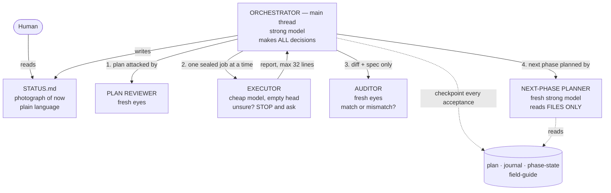

# oplan — orchestrated planning & execution for Claude Code


**One strong agent thinks. Cheap agents type. Fresh eyes check everything. Files remember everything.**

## The problem it solves

Give one AI agent a big multi-step task and three things quietly go wrong:

1. **Its head fills up.** A long session accumulates noise; late steps get worse because early
   steps are still rattling around in context. Nobody can empty the agent's head mid-task.
2. **It grades its own homework.** The same mind that wrote the code decides the code is fine.
   Bugs it couldn't see while writing are bugs it can't see while checking.
3. **It improvises.** When the plan is silent on a question, the agent picks an answer — and a
   different agent (or the same one, an hour later) picks a different answer. Now the project
   disagrees with itself and nobody knows.

## The idea

Split the work the way a good engineering team splits it — and make the *filesystem*, not any
agent's memory, the only place truth lives:



- **The orchestrator** (strong model) makes *every* design decision and does almost no typing.
- **Executors** (cheap model) are born with an empty head, receive one sealed "packet" — goal,
  exact files, frozen validation command, local lessons — and obey the skill's most important line:

  > If you hit a question the spec doesn't answer, STOP and return the question. Never decide it yourself.

- **Nobody self-certifies.** The orchestrator re-runs every validation itself; a fresh **auditor**
  sees only the diff and the spec and answers one narrow question: *does the work match the spec,
  nothing more, nothing less?* Unrequested "improvements" are defects too.
- **Files are the only memory.** Plan, journal, phase-state, and a 40-line curated lesson book
  live on disk. Kill any agent — including the orchestrator, mid-step — and a fresh one resumes
  from files alone. (This is tested by literally killing the process. See below.)
- **The next phase is planned by a fresh strong agent who may read only the files** — which
  doubles as a free test that the written record is actually complete.
- **Escalation is mechanical, never the worker's judgement:** validation fails twice → the same
  packet goes one model rung up, and the escalation is logged as data.
- **You hear everything twice, plain words first.** Before any work starts you get the plan as
  bullets — what each step does and *why* — and a go-ahead prompt. Every agent that reports back
  gets one jargon-free line on screen. Every phase closes with two reports: a plain-language one
  (what we did, what we found out, what went wrong, what it cost) and the technical one. No
  vocabulary required to follow your own run.

## Why believe any of this

The design is built on published evidence — Cursor's agent-swarm economics (strong planner +
cheap workers: comparable quality at ~8× lower cost; "spec quality beats worker capability"),
Cognition's multi-agent findings (single-threaded writes; fresh-context reviewers catch real
bugs), Anthropic's orchestrator-subagent research system, and the AgentCARD paper on mixed-model
teams. Sources and exact claims: [`DESIGN.md`](DESIGN.md) §2.

Then it was tested like it might be wrong — the full ledger is in [`tests/`](tests/) and
[`PROCESS.md`](PROCESS.md):

| Rung | What happened |
|---|---|
| **Paper test** | Two fresh agents attacked the skill text role by role: 29 findings, 6 blockers (worst: the plan itself wasn't a file — fixed). |
| **Smoke test** | A separate session ran a trivial 2-phase task; a separate grader verified every artifact byte by byte. PASS. |
| **Fire drill** | Automated sabotage: the runner was process-killed mid-step *twice* and resumed from files alone both times; an injected rogue instruction was handled as formal, reviewed change-control; the cost ceiling was exceeded ($11.73 vs $10) and recorded as a **FAIL**, because honest records outrank good grades. |
| **Real run** | A 5-phase autonomous build shipped a live production web app: 56 commits, 146/146 tests, zero model escalations. The executor STOP rule fired 7 times — every one a genuine plan defect, zero wrong code written. The auditor caught a UI dead-end that mocked tests missed. |

The design includes its own **kill criterion** (DESIGN.md §12): every run logs first-try pass
rate, retries, escalations, cost per model, and human interventions — and if the machinery can't
show fewer bugs, fewer interventions, or lower cost, the contract says shrink it or delete it.
Machinery that can't prove its value is fluff.

## Use it

```bash
git clone https://github.com/dkreinov/oplan && cp -r oplan/oplan ~/.claude/skills/oplan
```

Then, in a project with a multi-step job:

```text
Run this with the oplan skill. The frozen design is design.md — it is the WHAT, your plan
is the HOW. Execution mode: autonomous. Run all phases without pausing.
```

Best results come from a frozen `design.md` (the WHAT) written *before* the run — interrogate
the requirements first, then let the machinery own the HOW. Watch progress in the run's
`STATUS.md` (plain language, always current, rewritten never appended) and read the run's story
in `briefing.md` (the plan in bullets, then a plain-words report at every phase close).

## What's in the box

| Path | What |
|---|---|
| [`oplan/SKILL.md`](oplan/SKILL.md) | The whole procedure: roles, hard rules, files, verification layers, escalation ladder, metrics |
| [`oplan/templates/`](oplan/templates/) | The packets: executor, auditor, next-phase planner — plus the plain-words human report |
| [`PROCESS.md`](PROCESS.md) | How this was planned, built, and audited — the reusable method |
| [`DESIGN.md`](DESIGN.md) | The frozen design and its evidence base |
| [`tests/`](tests/) | The test ladder with real run records, including the failures |
| [`STATUS.md`](STATUS.md) | Photograph of the project's current state |
