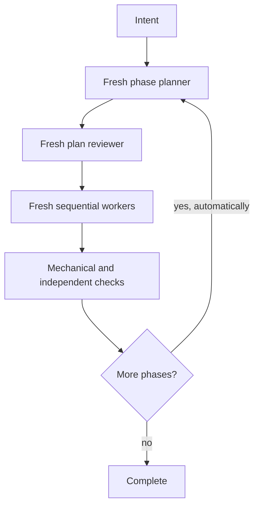

# oplan — a thin harness for multi-phase agent work

**Strong agents plan. Inexpensive fresh agents execute leaves. Independent agents check the
result. The main thread only keeps the machine moving and the human informed.**

`oplan` turns a substantial feature, refactor, or migration into a crash-safe sequence:



## What changed in v0.2

- Phase 1 and later phases are planned by fresh strong agents; the main thread never plans or codes.
- Successful phases continue automatically. Only complete, blocked, or material human-decision
  states stop the run.
- Phase planners write review-ready executor packets directly; the harness seals them after
  independent review, so plans and diffs do not fill the main thread's context.
- Every leaf has a reviewed machine control record and SHA-256 seal, so the thin harness can
  validate, revert, and commit safely without reading the feature plan.
- A worktree guard rejects undeclared writes; versioned attempt reports/questions make retries and
  resume crash-safe.
- Optional `grill-me` is used only when a planner cannot resolve a material product/design question.
- High-risk work and every phase gate receive a second, codebase-level review lens.
- Stable decision IDs prevent separate leaves from inventing incompatible versions of one concept.
- Workers can flag megafiles and necessary core changes without opportunistically expanding scope.

## Hardening since v0.2

- Every leaf control carries a `wall_time_minutes` bound the harness enforces as a cancellation
  boundary — a stuck executor becomes an ordinary failed attempt, never a hung run.
- Runs stay autonomous with automatic commits by default; supervised checkpoints
  (`pause-between-phases`, `step-by-step`) exist only when the user explicitly asks and are
  recorded as `run_modes` in `baseline.md`.
- The worktree guard captures byte-for-byte snapshots of each attempt's write set, and reverts
  restore exact pre-attempt bytes — uncommitted content that predated the attempt survives.
- `commit_mode: none` supports runs that must not commit: acceptance records per-path hashes,
  the auditor diffs snapshot bytes against the worktree, and write sets may safely overlap
  pre-existing dirty files.

## Use it

Install or copy `oplan/` into your agent's skills directory, then ask:

```text
Run this with oplan. Build <feature>. Keep me informed, continue through all successful phases,
and stop only for a material decision, a blocker, or completion.
```

Autonomous continuation is the default; the extra wording is explanatory, not a magic trigger.
The run waits only for a persisted material human decision, a blocker, or completion.

If the optional [`grill-me`](https://www.skills.sh/mattpocock/skills/grill-me) skill is installed,
oplan invokes it only for unresolved product/scope/UX trade-offs. Otherwise it uses a small bundled
fallback that asks one question at a time with a recommended answer.

## Files

| Path | Purpose |
|---|---|
| [`oplan/SKILL.md`](oplan/SKILL.md) | Small load-bearing orchestration contract |
| [`oplan/templates/`](oplan/templates/) | Planner, curator, research, executor, reviewer, and human-report packets |
| [`oplan/references/`](oplan/references/) | State, grill gate, and model-binding details loaded only when needed |
| [`oplan/scripts/`](oplan/scripts/) | Deterministic skill-contract and per-run state/packet validation |
| [`DESIGN.md`](DESIGN.md) | v0.2 architecture and evidence mapping |
| [`tests/`](tests/) | Paper, autonomous smoke, and fire-drill tests |

Run the local contract check:

```bash
python3 oplan/scripts/validate_skill_contracts.py
```

Each active run also validates its Git baseline, action grammar, decision state, phase/leaf
controls, and seals with `oplan/scripts/validate_run.py`; `worktree_guard.py` enforces the write
boundary around every executor.

## Evidence

The central influence is Cursor's
[Agent swarms and the new model economics](https://cursor.com/blog/agent-swarm-model-economics):
task trees, strict planner/worker separation, specs as prompts, decorrelated review lenses,
decision propagation, and agent-curated Field Guides. `DESIGN.md` maps every adopted mechanism and
also explains why oplan does not copy Cursor's high-concurrency VCS machinery while it has one
sequential product writer.
