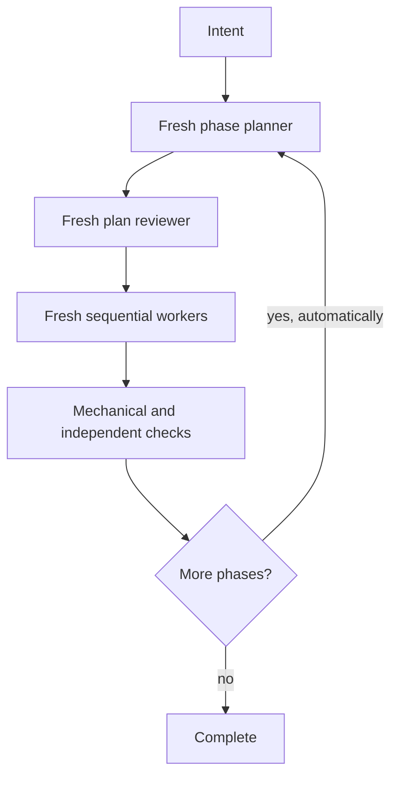

# oplan — a thin harness for multi-phase agent work

**Strong agents plan. Inexpensive fresh agents execute leaves. Independent agents check the
result. The main thread only keeps the machine moving and the human informed.**

`oplan` turns a substantial feature, refactor, or migration into a crash-safe sequence:



## How it works

- The main thread is a thin state machine: it never plans features or writes product code. Fresh
  strong planners decompose each phase into review-ready executor packets; a fresh plan reviewer
  attacks the plan before anything runs.
- Every leaf has a reviewed machine control record and SHA-256 seal, so the harness can validate,
  revert, and commit safely without reading the feature plan. Runs continue automatically through
  successful phases and stop only for completion, a blocker, or a material human decision.
- A worktree guard snapshots each attempt's write set byte-for-byte, rejects undeclared writes,
  and reverts failed attempts to their exact pre-attempt bytes — uncommitted content that predated
  the attempt survives.
- Each leaf control carries a `wall_time_minutes` bound the harness enforces as a cancellation
  boundary, so a stuck executor becomes an ordinary failed attempt instead of a hung run.
- Autonomous auto-commit is the default. Supervised checkpoints (`pause-between-phases`,
  `step-by-step`) and `commit_mode: none` (no-commit runs audited from snapshot bytes) exist only
  when the user explicitly asks for them.
- Stable decision IDs keep separate leaves from inventing incompatible versions of one concept;
  workers can flag megafiles and necessary core changes without opportunistically expanding scope.
- High-risk work and every phase gate receive a second, codebase-level review lens.
- Each run records a depth profile (`fast`, `standard`, `paranoid`) and a work mode
  (`engineering`, `experiment`) chosen with the user at the start, and when no user can answer the
  harness picks by the same recorded recommendation rule, records the choice and its reason, and
  never blocks; the profile changes review
  depth and planning effort only, never the Git baseline, seals, single-writer rule, guard, or
  commit scoping.

Current reviewed behavior lives in [STATUS.md](STATUS.md).

## Use it

Install or copy `oplan/` into your agent's skills directory, then ask:

```text
Run this with oplan. Build <feature>. Keep me informed, continue through all successful phases,
and stop only for a material decision, a blocker, or completion.
```

The extra wording is explanatory, not a magic trigger.

If the optional [`grill-me`](https://www.skills.sh/mattpocock/skills/grill-me) skill is installed,
oplan invokes it for unresolved product/scope/UX trade-offs; otherwise a small bundled fallback
asks one question at a time with a recommended answer.

## Files

| Path | Purpose |
|---|---|
| [`oplan/SKILL.md`](oplan/SKILL.md) | Small load-bearing orchestration contract |
| [`oplan/templates/`](oplan/templates/) | Planner, curator, research, executor, reviewer, and human-report packets |
| [`oplan/references/`](oplan/references/) | State, grill gate, and model-binding details loaded only when needed |
| [`oplan/scripts/`](oplan/scripts/) | Skill-contract validation, per-run state/packet validation, and the worktree guard |
| [`DESIGN.md`](DESIGN.md) | Architecture and evidence mapping |
| [`tests/`](tests/) | pytest suites for the validators and guard, plus paper, smoke, and fire-drill tests |

Run the local checks:

```bash
python3 oplan/scripts/validate_skill_contracts.py
python3 -m pytest tests/
```

## Evidence

The central influence is Cursor's
[Agent swarms and the new model economics](https://cursor.com/blog/agent-swarm-model-economics);
[`DESIGN.md`](DESIGN.md) maps every adopted mechanism and the deliberate differences.
