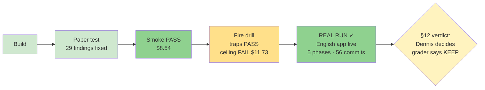

# STATUS — the `oplan` skill

> This file is a **photograph of now** — fully rewritten at every update, never appended.
> History lives in git and in `work_log.md`. Last rewrite: 2026-07-24.

## Where are we, in one sentence

**The real run happened and succeeded** — a 5-phase oplan run built and deployed the English app
end-to-end (live on Vercel, 146/146 tests, graded from artifacts) — and the §12 keep/shrink/kill
decision is now in Dennis's hands, with the grader recommending **KEEP, unshrunk**.

## The ladder — complete

## The real run, graded from artifacts (not the runner's report)

Verified directly: 56 commits ✓ · clean tree ✓ · **146/146 tests pass in the grader's own clean
run** ✓ · journal complete (625 lines, all metrics blocks, sums present) ✓ · full record in
`english-app/.oplan/first-build/` ✓. Only unverified-by-grader claim: the live URL (grader's
shell has no network; the journal records live production verification, Dennis's browser confirms).

| §12 criterion | Evidence from the run |
|---|---|
| Fewer bugs reaching the user | Checker layer caught: 1 real UI dead-end (wrong quiz answer locked the chapter forever — would have reached the young learner), 2 executor contract slips, 2 pre-execution plan defects, 3 tooling gaps. Live gates caught 2 design flaws that 146 mocked tests missed. Executor STOP rule fired 7 times — **finally tested in anger** — every stop a genuine planner defect, zero wrong code written. |
| Interventions | 12 total, all logged with reasons; none was "the machinery is confused", all were real decisions surfacing to the right place. |
| Cost | ~2.78M subagent tokens (workers 1.41M / checkers 1.00M / planners 0.40M). ai-cost: **$122.96** for the whole english-app day (grill + build). No paired plain-plan-skill baseline exists, so the cost *comparison* is honestly unknowable — but checker overhead ≈ worker spend, and what it bought is the column to the left. |
| Escalations | **0** — Sonnet handled all 22 worker steps; the ladder was never climbed. The strong-planner/cheap-worker thesis held on real work. |

**The auditor redeemed itself.** After 0-for-11 on toy tasks, on real work it caught the
empty-body contract slip and the retry-lockout dead-end — exactly as the caveat predicted
("its value starts where byte-exact validations stop"). The shrink candidate is withdrawn by its
own evidence. Weakest link instead: orchestrator summarizing specs into audit packets
(2 false positives) — the "paste verbatim" rule, learned twice, now in the field guide.

## What exists

| Thing | State |
|---|---|
| `oplan/` (SKILL.md + 3 templates) | ✅ Proven on a real product build |
| `PROCESS.md` | ✅ The method record |
| Tests: paper / smoke / drill ×2 / real run | ✅ All run, all graded, all recorded |
| The English app | ✅ **Live**, awaiting Dennis's owner gate (item-bank review ~30 min, one manual tap test, PWA install on her phone — `english-app/docs/owner-handoff.md`) |
| Installed at `~/.claude/skills/oplan/` | ❌ Awaiting Dennis's §12 verdict — one copy command when he says "keep" |

## Costs, whole project (ai-cost, API-equivalent)

Proving the machine: smoke $8.54 + drills $17.44 ≈ $26 · Real run day (grill + build): $122.96 ·
Skill-repo sessions: ~$59 across both days.

## Next action

Dennis: (1) say **keep / shrink / kill** — grader recommends keep, unshrunk; (2) if keep, install
to `~/.claude/skills/oplan/`; (3) do the app's owner gate before the learner's first placement.
