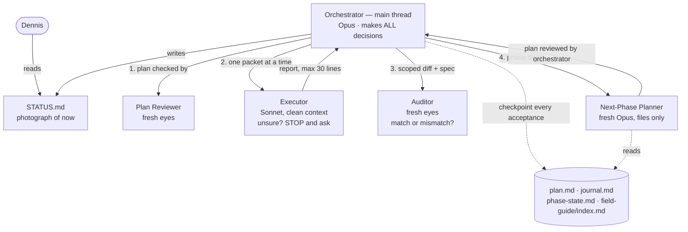

# STATUS — the `oplan` skill

> This file is a **photograph of now** — fully rewritten at every update, never appended.
> History lives in git and in `work_log.md`. Last rewrite: 2026-07-23.

## Where are we, in one sentence

The skill is **written and paper-tested** — every deliverable exists in this repo; the next
action is to run the smoke test in a scratch folder, and nothing is installed yet.

## What exists right now

| Thing | State |
|---|---|
| `DESIGN.md` | ✅ Frozen — still the single source of truth |
| `oplan/SKILL.md` | ✅ The skill: roles, hard rules, files, verification, tiers, procedure, metrics |
| `oplan/templates/executor-packet.md` | ✅ The 7-element worker packet |
| `oplan/templates/auditor.md` | ✅ Fresh-eyes checker (diff + spec only) |
| `oplan/templates/next-phase-planner.md` | ✅ Fresh planner (files only) |
| `tests/paper-test.md` | ✅ Written **and run** — 29 findings, 6 blockers, all fixed |
| `tests/smoke-test.md` | ✅ Written — ⏳ not run yet |
| `tests/fire-drill.md` | ✅ Written — ⏳ not run yet (traps + resume drill + $10 ceiling) |
| `plans/oplan-build-plan.md`, `work_log.md` | ✅ The build's own plan and record |
| Installed at `~/.claude/skills/oplan/` | ❌ Deliberately not yet — install only after the tests pass |
| Real-run test case (English app) | ⏳ Waiting for details from Dennis |

## What the skill does, simply

One strong manager plans everything and decides everything; cheap workers each get one
completely-written job in a fresh head; separate fresh-eyed checkers verify the plan and every
result; all memory lives in files, so any agent — including the manager — can die and be replaced.

## Decided (were the open questions in DESIGN.md §15)

| Question | Decision |
|---|---|
| Skill name | `oplan` |
| Report format | STATUS · DID · VALIDATION · SURPRISES · DEVIATIONS · QUESTION · METRICS — hard cap 30 lines |
| Field-guide budget | 40 lines, **soft** — over budget needs a one-line justification in the journal |
| Models | Generic tiers + a per-harness binding table. Claude: orchestrator/planner Opus, executor/auditor Sonnet, ladder Haiku < Sonnet < Opus < Fable |
| Fire-drill cost ceiling | $10 API-equivalent, recorded either way |

## What the paper test changed (the design was not enough on its own)

The biggest miss: **the plan itself was not a file.** Every step spec and validation command lived
in the manager's head, which breaks the crash-only rule the design insists on — so a fifth
workspace file, `plan.md`, now exists. Also added: a defined packet for the plan reviewer, an
account of *what was built* in the journal (not just scores), an end to every retry loop, and
diffs scoped to the step's own files so the auditor doesn't blame workers for the manager's writes.

## Next action

Run the **smoke test** (`tests/smoke-test.md`) in a scratch folder outside this repo — trivial
task, proves the plumbing moves. Then the **fire drill** (`tests/fire-drill.md`) with its planted
traps, then the **real run** on the English app, then compare metrics against a plain plan-skill
baseline and decide: keep, shrink, or kill (DESIGN.md §12).

## Open

- English-app details (the real test case) — waiting on Dennis.
- Two numbers are guesses until data replaces them: the 40-line field-guide budget and the $10
  drill ceiling. Both are recorded in metrics precisely so the first runs can correct them.
