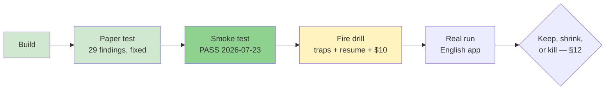

# STATUS — the `oplan` skill

> This file is a **photograph of now** — fully rewritten at every update, never appended.
> History lives in git and in `work_log.md`. Last rewrite: 2026-07-23 (evening).

## Where are we, in one sentence

The skill is built, paper-tested, and has now **passed its first smoke test on a real run** —
next rung is the fire drill (planted traps, $10 ceiling), and nothing is installed yet.

## The ladder (where we stand)

## What exists right now

| Thing | State |
|---|---|
| `DESIGN.md` | ✅ Frozen, one ratified amendment (`plan.md` as fifth workspace file) |
| `oplan/SKILL.md` + 3 templates | ✅ Built, paper-tested, patched with smoke-run lessons |
| `tests/paper-test.md` | ✅ Run — 29 findings, 6 blockers, all fixed |
| `tests/smoke-test.md` | ✅ **Run — PASS** (run `hello-shout`, graded from artifacts; row recorded) |
| `tests/fire-drill.md` | ⏳ Written, not run — next action |
| Installed at `~/.claude/skills/oplan/` | ❌ Only after the fire drill passes |
| Real-run test case (English app) | ⏳ Waiting for details from Dennis |

## What the smoke test proved (and what it cannot prove)

**Proved:** every role spawns and answers in format; the five workspace files follow their rules;
the orchestrator re-validates everything itself; a `/clear` at the phase boundary resumes from
files alone with zero questions; and the machinery catches real defects — 5 in the plan before any
execution, a false-pass hole in a phase gate, and 3 of the orchestrator's own discipline slips,
found by a fresh agent reading the record cold.

**Cannot prove:** that any of this pays for itself. The checker tier cost 2.9× the worker tier on
a 26-byte task (~323k subagent tokens total; grader's upper-bound ≈ $7.4). Expected for a smoke
test — the only question that matters next is whether that ratio inverts on real work.

**Smoke-run lessons folded back into the skill:** phase gate now requires a STATUS rewrite (root
cause of the one discipline slip); totals must be computed by command, never mentally (a sum was
mis-added and self-caught); a run whose skill isn't installed vendors the skill into its workspace
(the runner improvised this correctly — now it's a rule).

## Next action

Run the **fire drill** (`tests/fire-drill.md`): scratch folder outside this repo, the
Hebrew–English quiz slice, two planted traps + the kill-and-resume drill, $10 ceiling.
Same split as the smoke test: fresh session runs it, this home session grades it.

## Open

- English-app details (the real test case) — waiting on Dennis.
- Fire-drill trap 1 requires the human to check the plan before execution (see the trap's
  "disarmed-inconclusive" rule) — it is not fully hands-off.
- Still guesses until data: the 40-line field-guide budget (37/40 used in the smoke run — tight
  but held) and the $10 drill ceiling (smoke run's upper bound came close at ~$7.4).
