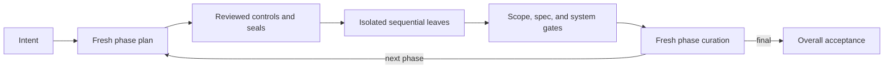

# STATUS — oplan

> Current state of `main` (v0.2 merged plus post-merge hardening).

## Now

v0.2 is merged to `main`, published, and deployed. The main thread is a thin state-machine harness; fresh
isolated planners/reviewers/curators own reasoning, fresh inexpensive executors own one sealed
leaf, and successful phases continue automatically through final overall acceptance.

## Reviewed behavior

- Verified Git baseline and protected pre-existing dirty paths.
- Versioned phase/leaf controls, plan-review hashes, decision promotion, and idempotent sealing.
- Pre/post worktree guard for undeclared writes.
- Durable capped role reports, questions, evidence, retry/mismatch history, and human blockers.
- Deterministic transitions for every role verdict, research/evidence repair, phase curation,
  next-phase continuation, final overall acceptance, and resume.
- Optional `grill-me` only for unresolved material product/scope/UX decisions.
- Parent-enforced `wall_time_minutes` cancellation bound on every leaf.
- Byte-level attempt snapshots with snapshot-based revert; `commit_mode: none` for no-commit runs.
- Supervised run modes recorded only on explicit user request; autonomous auto-commit is default.

## Checks

- Independent lifecycle audit: all blockers and should-fixes resolved.
- Independent forward probe: thin harness and fresh repair planning observed; its early snapshot
  gaps are covered by the final validators/contracts.
- `26` unit tests pass.
- Skill contract validator, standard skill validator, `py_compile`, local link check, and
  `git diff --check` pass.
