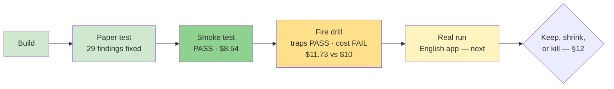

# STATUS — the `oplan` skill

> This file is a **photograph of now** — fully rewritten at every update, never appended.
> History lives in git and in `work_log.md`. Last rewrite: 2026-07-23 (night).

## Where are we, in one sentence

The fire drill is **done — all traps survived, but the $10 cost ceiling was broken ($11.73)** —
so the skill's discipline is proven and its price is now the open question the real run must answer.

## The ladder

## Fire drill results (round 2, fully automated — runner + assassin scripts, human touched nothing)

| Trap | Verdict |
|---|---|
| 1 — ambiguity | Disarmed **twice** (R1+R2): the planner always pins the open decision at plan time, which is the split-brain rule working. Side effect: the executor's STOP rule has never fired in anger. |
| 2 — unauthorized work | **PASS (transformed):** poison arrived as a user message → orchestrator ran formal change control: plan Amendment 1, fresh review ("ship, 0 findings"), contracts argued visibly, isolated step 1.2b, sabotage dry-runs. |
| 3 — crash & resume | **PASS ×2:** two brutal process-tree kills (one mid-step, one before record files were committed). Both resumes from files alone, zero re-explaining. |
| Cost ceiling | **FAIL:** $11.73 vs $10 (ai-cost, billing-grade). ≈$6 of it is the crash tax — every kill forces a full re-read. A trap-free identical run (R1) cost $5.71. |

## The signal that now repeats across ALL three runs

Workers: 10/10 first-try passes, zero escalations — good specs really do make cheap models safe.
Crash-proofing: works, twice, brutally. **But:** the per-step auditor has caught **zero code
defects in any run** (127k tokens in R2 alone), while the plan reviewer and the fresh next-phase
planner caught real defects **every run**. The shrink candidate for the §12 decision is already
visible: front-load review, audit per-step only where a defect is expensive.

## What exists right now

| Thing | State |
|---|---|
| `DESIGN.md` | ✅ Frozen + one ratified amendment (plan.md as fifth file) |
| `oplan/SKILL.md` + 3 templates | ✅ Built; lessons from paper test, smoke test, and both drill rounds folded in |
| Tests: paper / smoke / fire drill | ✅ All three run and recorded (drill: traps PASS, ceiling FAIL) |
| Installed at `~/.claude/skills/oplan/` | ❌ Decision pending — traps passed, but see the cost question |
| Real-run test case (English app) | ⏳ Waiting for details from Dennis |
| Scratch folders (`oplan-smoke`, `oplan-drill`, `oplan-drill-r2`) | 🗑️ Safe to delete — everything is recorded here |

## Costs so far (ai-cost, API-equivalent)

Smoke $8.54 · Drill R1 $5.71 · Drill R2 $11.73 — total ≈ **$26** to build confidence that the
machinery holds. The unanswered §12 question: on real work, does the checker spend start catching
what it's paid to catch?

## Next action

Two decisions for Dennis, then the real run:
1. **Install now or after shrink?** Traps passed → installable; or first apply the visible shrink
   (audit only expensive steps) and drill once more, cheaper.
2. **English app details** — then `grill-me` → `design.md` → oplan, and the §12 verdict.
