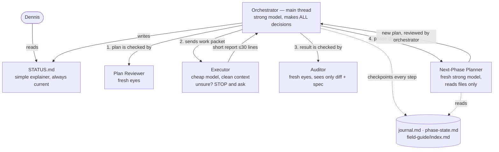

# STATUS — Orchestrated Planning Skill

> This file is a **photograph of now** — it is fully rewritten at every update, never appended.
> History lives in git and (once runs start) in `journal.md`. Last rewrite: 2026-07-23.

## Where are we, in one sentence

The design is **frozen and written down** (`DESIGN.md`); nothing has been built yet — the next
action is to open a fresh session and run the existing plan-skill to plan the build.

## What exists right now

| Thing | State |
|---|---|
| `DESIGN.md` | ✅ Complete — the single source of truth for the build |
| `STATUS.md` | ✅ This file |
| Git repo | ✅ Initialized (`main`) |
| `SKILL.md` (the skill itself) | ❌ Not started |
| Prompt templates (executor packet, auditor, next-phase planner) | ❌ Not started |
| `tests/` (paper / smoke / fire-drill + traps + resume drill) | ❌ Not started |
| Real-run test case (English app for Dennis's young learner) | ⏳ Waiting for details from Dennis |

## What we are building (the system, simply)

One strong "manager" plans and decides everything; cheap "workers" each get one clearly-written
job in a fresh head; separate fresh-eyed "checkers" verify every result; all memory lives in
files so any agent can die and be replaced; and you follow it all through this kind of page.

## The plan from here (test ladder)

Build skill → **paper test** (read-through) → **smoke test** (does the plumbing move) →
**fire drill** (planted traps + kill-and-resume drill, in a scratch folder) → **real run**
(English app) → compare metrics vs old plan-skill → **keep, shrink, or kill** (the anti-fluff
contract, DESIGN.md §12).

## Next action

Fresh session (`/clear`), paste the handoff prompt (in the latest chat message / git log),
which runs plan-skill on: *"Build the orchestrated planning skill per DESIGN.md."*

## Open questions (decided during planning, not now)

Skill name · report format details · field-guide line budget · default model per role ·
fire-drill token ceiling — full list in DESIGN.md §15.
