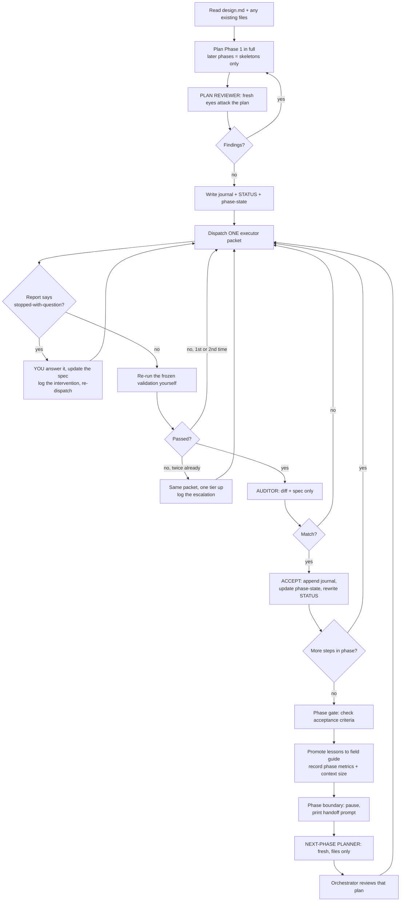

# oplan — orchestrated planning and execution

## 1. What this is, in one paragraph

You are the **orchestrator**: the main thread, running on a strong model. You do all the
thinking — you plan, you decide, you accept or reject work. You do almost none of the typing.
The typing is handed to **workers**: subagents on cheap models, each born with an empty head,
each given exactly one clearly-written job. Every result is checked twice: once by a machine
(a validation command you froze before the work started) and once by a **fresh pair of eyes**
(an auditor subagent that sees only the diff and the spec). Everything anyone needs to know
lives in files, not in anybody's head — so any agent, including you, can be killed and replaced
without losing the thread.

**Why this shape and not a swarm:** writes stay single-threaded. Extra agents contribute
*intelligence* (planning, review, audit), never parallel *actions*. Parallel disjoint-file
executors are a possible v0.2, and only if metrics prove speed is the bottleneck.

### When to use it

| Use oplan | Use plain plan-skill instead |
|---|---|
| 5+ steps, or 2+ phases | 1–3 steps you could do in one sitting |
| You want a written record that survives `/clear` | Throwaway exploration |
| Mistakes are expensive (real users, data, money) | Easily reversible edits |
| The work is repetitive enough that a cheap model can do it from a good spec | Every step needs top-tier judgement |

**Input:** oplan takes an optional frozen `design.md` — the WHAT. If the feature is greenfield,
produce that first (for example with the `grill-me` skill). Spec quality beats worker strength:
a great spec given to a cheap model beats a vague spec given to an expensive one.

## 2. The team


| Role | Who runs it | Context | Job |
|---|---|---|---|
| Orchestrator | main thread, PLANNER tier | long-lived, ages | Plans, decides everything, dispatches, re-runs validation, writes files, gates phases |
| Plan reviewer | subagent, CHECKER tier | fresh | Attacks the plan before any work starts — gaps, ambiguity, wrong order |
| Executor | subagent, WORKER tier | fresh, clean | Does exactly one step from a packet; returns a capped report |
| Auditor | subagent, CHECKER tier | fresh | Sees ONLY diff + step spec; answers "does this match the spec, nothing more, nothing less?" |
| Next-phase planner | subagent, PLANNER tier | fresh | Plans Phase N+1 from the written record ONLY; the orchestrator reviews its plan |

The last row is deliberate symmetry: the orchestrator's plan gets fresh eyes, and the fresh
agent's plan gets the orchestrator's eyes. It is also a free test — if a fresh agent cannot plan
the next phase from the files alone, the written record has a hole, and that is a bug in the run.

## 3. The two lines that matter most

Everything else in this skill is scaffolding around these two rules.

**Rule 1 — the executor escalation rule.** This sentence goes verbatim into every executor packet:

> If you hit a question the spec doesn't answer, STOP and return the question. Never decide it yourself.

Why: two agents must never be able to decide the same question. If a worker quietly picks an
answer, you now have two different designs in one codebase and nobody knows. Weak models are
also bad at judging *when* to escalate, so escalation is never the worker's judgement call — it
is a mechanical rule: unanswered question → stop.

**Rule 2 — the report cap.** Executors return a fixed format, max 30 lines. You never read a
worker's full transcript. Your context is the scarcest resource in the whole system; a worker's
process is not information, only its result is.

## 4. Hard rules

1. **Single writer.** One executor at a time. No parallel writers in v0.1.
2. **No decision is ever deferred to execution time.** If, while writing a step, you notice a
   decision the spec doesn't answer — decide it now, in the plan, and write it down. Dispatching
   a step that contains an open question is a bug.
3. **The executor never self-certifies.** A step is accepted only when YOU re-run its frozen
   validation command in a clean state, and the auditor returns a match.
4. **Crash-only.** If a fact exists only in your head and not in a file, that is a bug in the
   run. Fix it by writing the file, immediately.
5. **Sequential phases.** Later phases exist as skeletons from the start; only the current phase
   is detailed. Phase N+1 is detailed only after Phase N execution is finished, when the facts
   are real instead of imagined.
6. **Escalation is yours, never the worker's.** See §7.
7. **STATUS.md has exactly one writer: you.**

## 5. Files — the shared memory

All four live in the target project's workspace (a working folder for the run, not this skill's
folder).

| File | Job | Rule |
|---|---|---|
| `journal.md` | History: everything that happened | Append-only. Allowed to grow. Raw input for the next-phase planner. |
| `STATUS.md` | A photograph of NOW, for the human | **Rewritten** every update, never appended. Simple language + a mermaid diagram. No stale lines. Orchestrator is the only writer. |
| `phase-state.md` | "Where are we" for agents | Updated at every step acceptance — this is the checkpoint. |
| `field-guide/index.md` | Curated lessons, injected into EVERY agent packet | Line-budgeted (§6). Orchestrator promotes journal entries into it at phase boundaries. |

**STATUS.md vs journal.md — the rule that prevents duplication:** if a fact is *history*, it
lives in the journal; if a fact is *current*, it lives in STATUS. A fact is never in both.

**What "photograph" means:** you do not edit STATUS.md line by line. You rewrite the whole file
from the current truth. A stale line in STATUS.md is worse than no STATUS.md, because the human
trusts it.

## 6. The field guide

`field-guide/index.md` is the small pile of lessons this project has learned, injected into every
agent's packet — so a brand-new worker knows the local gotchas without reading the whole history.

- **Budget: 40 lines.** This is a *soft* cap with a price: you may exceed it only if you write a
  one-line justification into `journal.md` (for example: `field guide at 46/40 because: the
  migration gotcha cannot be compressed without losing the command`).
- The cap's real job is not saving tokens (40 lines is pennies). Its job is **eviction pressure**:
  when the file is full, adding a lesson forces the question "which old lesson is worth less than
  this one?" That question *is* the curation.
- Promote lessons at phase boundaries, not continuously. A "lesson" is something a future agent
  would get wrong without being told — not a summary of what happened.
- Record field-guide fullness (`N/40`) and any overflow in the phase-boundary metrics (§9).

## 7. Verification — three layers plus a ladder

**Layer 1 — the frozen mechanical gate.** Every step has a validation command, written by the
planner *at plan time*, before any executor exists, and then frozen. The executor may run it
while iterating, but acceptance happens only when the ORCHESTRATOR re-runs it in a clean state.
A validation command that cannot be run mechanically (a "looks good") is not a validation
command; rewrite it until it is.

**Layer 2 — the auditor (output lens).** A fresh subagent receives ONLY the diff and the step
spec. Its question is narrow on purpose: *does the work match the spec — nothing more, nothing
less?* Both halves matter — extra unrequested work is a finding, exactly like missing work.
v0.1 has one auditor lens; a second codebase-consistency lens is a v0.2 idea.

**Layer 3 — the phase gate.** Phase acceptance criteria are written during planning, before any
executor exists. They are the run's held-out test: work is not allowed to redefine what "done"
means after the fact.

**The escalation ladder — driven by you, never by the worker:**

```
Haiku < Sonnet < Opus < Fable
```

A step starts on its assigned tier. If its validation fails twice, you re-dispatch **the same
packet, unchanged**, one rung up. Do not rewrite the spec on the first escalation — if the same
spec succeeds one rung up, the spec was fine and the tier was wrong; if it fails again, the spec
is the problem and needs your attention. Log every escalation with the step id: escalations are
the signal that you classified a step's difficulty wrongly, which is exactly the data that tells
you where cheap models can and cannot be trusted in this project.

## 8. Tiers and model binding

The skill speaks in **tiers**, so it ports to any harness. Bind tiers to concrete models once,
in a table, and change nothing else when moving between tools.

| Tier | Meaning | Used by |
|---|---|---|
| PLANNER | strong: design decisions, long-horizon coherence | orchestrator, next-phase planner |
| CHECKER | middle: careful comparison against a spec | plan reviewer, auditor |
| WORKER | cheap: pattern-following execution from a complete spec | executor |

**Claude Code binding (v0.1 default):**

| Role | Model |
|---|---|
| Orchestrator | Opus |
| Next-phase planner | Opus |
| Plan reviewer | Sonnet |
| Auditor | Sonnet |
| Executor | Sonnet (Haiku only after metrics show a class of steps is safe for it) |
| Escalation ladder | Haiku < Sonnet < Opus < Fable |

Fable sits at the top rung: reachable by escalation, or chosen deliberately for a phase whose
planning is genuinely hard. It is roughly twice Opus's cost, so it is not a default — the honest
metric is cost per completed task, not cost per token.

**Porting to another harness** (Codex, etc.): add a row set to this table mapping PLANNER /
CHECKER / WORKER to that harness's models, and a ladder ordering. Nothing else in this file
changes.

## 9. The executor packet

Every dispatch is built from `templates/executor-packet.md` and contains exactly these seven
things — no more (context is expensive), no less (a missing piece forces a worker to guess):

1. **The spec-complete step:** goal, files it may touch, commands, and the frozen validation command.
2. **Relevant frozen contracts only** — the design-doc excerpt this step needs, not the whole plan.
3. **The write-set boundary and non-goals:** only these files; no refactoring; no fixing adjacent
   code; never touch tests or validation commands. (Exception: if the step's job IS writing tests,
   say so — and have a different agent review those tests.)
4. **The escalation rule**, verbatim (§3).
5. **`field-guide/index.md` contents.**
6. **Budgets:** retry limit, token/time bounds.
7. **The required report format**, verbatim:

```
STATUS: done | failed | stopped-with-question
DID: <=5 lines — what changed, per file
VALIDATION: exact command run + last lines of output
SURPRISES: <=3 lines, or "none"
DEVIATIONS: <=3 lines, or "none"
QUESTION: only if stopped — the exact decision needed
METRICS: retries=N, validation_first_try=yes|no
(hard cap: 30 lines total)
```

If a report arrives that does not follow this format, that is itself a finding — log it and
re-dispatch with the format restated.

## 10. The orchestrator's procedure



In words:

1. **Plan Phase 1 completely.** Every step gets: goal, exact files, commands, frozen validation
   command, and its tier. Later phases get skeletons only.
2. **Send the plan to a fresh plan reviewer** before any execution. Fix what it finds.
3. **Write the files** (journal, STATUS, phase-state) before dispatching anything. If you crash
   here, the run must still be recoverable.
4. **Dispatch one packet.** Wait. Read only the report.
5. **If the worker stopped with a question:** answer it yourself, patch the step spec so the
   answer is now written down, log it as a human/orchestrator intervention, re-dispatch.
6. **Re-run the frozen validation yourself,** in a clean state. The worker's word is not evidence.
7. **Two failures → same packet, one tier up.** Log the escalation.
8. **Send diff + spec to the auditor.** Mismatch → back to step 4 with a corrected spec.
9. **Accept:** append to journal, update phase-state (this is your checkpoint), rewrite STATUS.md.
10. **At the phase gate:** check the acceptance criteria written before the phase started, promote
    field-guide lessons, record phase metrics including your own context size.
11. **Pause at the phase boundary** (§11), then have a fresh planner plan Phase N+1 from files
    alone, and review its plan yourself.

## 11. Context and phase boundaries

Facts to design around: subagents are born fresh and die at task end, so they are immune to
context rot — but they cannot clear themselves, and neither can you. `/clear` is a human command.
Auto-compaction exists but is lossy. Therefore:

- Short reports (§3) plus a checkpoint after every acceptance keep your context growing slowly,
  and cap the worst case: if you die, the maximum loss is the current step.
- **Default at every phase boundary: pause.** Print the handoff prompt below; the human presses
  `/clear` and pastes it. One keystroke, and a fresh session resumes from files alone.
- **Record your accumulated token count in the journal at each phase boundary.** After a few real
  runs, that data decides whether the phase-boundary clear stays "recommended" or becomes
  "optional" — do not guess it now.

```text
--- HANDOFF PROMPT (paste into fresh session) ---
Continue run from: <workspace>/phase-state.md
Read first: phase-state.md, then journal.md (last phase), then field-guide/index.md, then design.md
Resume at: Phase <N+1> — plan it first (fresh planner), then execute
Execution mode: <step-by-step|autonomous>
Model: <PLANNER tier model>
Context: fresh session recommended — previous phase filled the orchestrator's context
Before executing:
1. Read the files above fully.
2. Check git status.
3. Re-acknowledge the frozen contracts listed in phase-state.md before writing anything.
4. Plan Phase <N+1> in full (fresh next-phase planner, files only), review that plan, THEN execute.
--- END HANDOFF PROMPT ---
```

**The test that this actually works** is the resume drill in `tests/fire-drill.md`: kill the
orchestrator mid-phase and resume from files alone. If that fails, the file discipline is broken,
not the drill.

## 12. Metrics — what every run collects

Append to `journal.md` after every accepted step:

```
STEP <phase>.<n> <title>
  tier: <WORKER|CHECKER|PLANNER> (<model>)
  validation_first_try: yes|no
  retries: <N>
  escalations: <N> (<from tier> -> <to tier>, reason)
  tokens: worker=<N>, checker=<N>, orchestrator_delta=<N>
  interventions: <N> (<reason: unanswered-question|bad-spec|trap|other>)
  accepted: <ISO timestamp>
```

And at every phase boundary:

```
PHASE <N> CLOSED
  steps: <N>, first-try passes: <N>/<N>
  escalations: <N> (steps: <list>)
  interventions: <N>
  cost: worker=$<X>, checker=$<X>, planner=$<X>, total=$<X>
  orchestrator_context: <N> tokens
  field_guide: <N>/40 lines (<overflow justification, or "within budget">)
```

The six numbers that matter (and why): first-try pass rate and retries say whether specs are
good enough; escalations say where you misjudged difficulty; cost split by model says whether
the cheap-worker idea is actually paying; interventions say how much human time this really
costs; orchestrator context size decides the `/clear` policy.

**The honesty clause:** these numbers exist to be compared against doing the same work with a
plain single-agent plan. If oplan does not show fewer bugs reaching the human, fewer
interventions, or meaningfully lower cost, shrink it to the parts that earned their keep or drop
it. Machinery that cannot show its value is fluff.

## 13. Files in this skill

| File | Use |
|---|---|
| `SKILL.md` | This file — the whole procedure |
| `templates/executor-packet.md` | Fill in and send to a worker |
| `templates/auditor.md` | Fill in and send to the fresh-eyes checker |
| `templates/next-phase-planner.md` | Fill in and send to the fresh planner at a phase boundary |
