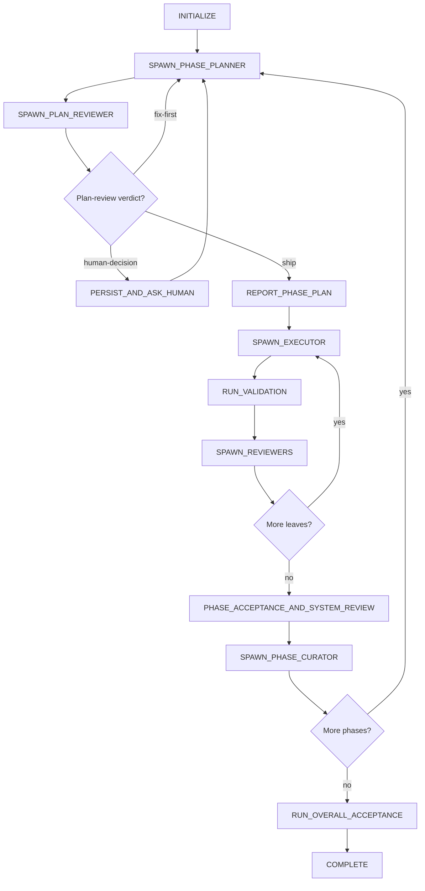

# oplan — thin-harness planning and execution

## 1. Core contract

Act as a **thin orchestration harness**. Do not plan features and do not implement them. Keep the
main thread small enough to coordinate a long run without filling it with code, diffs, transcripts,
or planning detail.

Use fresh agents to do the thinking and work:

- a strong **phase planner** decomposes the next phase and writes review-ready packets/controls;
- a fresh **plan reviewer** attacks that plan before execution;
- a new inexpensive **executor** implements each leaf step in isolation;
- a fresh **spec auditor** checks that a step matches its packet;
- a fresh **system reviewer** checks integration at high-risk steps and every phase gate.
- a fresh **phase curator** reconciles evidence before close; a fresh evidence reviewer resolves
  one low-confidence audit when needed.

The harness may only:

1. read the small `phase-state.md` control record;
2. spawn the role named by `NEXT_ACTION` with a clean context;
3. receive a capped structured report;
4. read the small sealed leaf control record named by `NEXT_ACTION`;
5. run frozen mechanical checks while keeping full logs on disk;
6. update orchestration records and scoped commits;
7. explain progress to the human in plain language.

Never read a subagent transcript. Never paste a full plan, journal, code file, or diff into the
main thread. Give agents paths to scoped artifacts and receive only their capped reports.

> **A successful phase close is never a terminal state.** Unless the run is `COMPLETE`,
> `BLOCKED`, or `AWAITING_HUMAN_DECISION`, immediately perform `NEXT_ACTION`. Do not return a
> final response between phases.

## 2. Why this shape

Large tasks form trees. Strong planners lower intent into smaller nodes; inexpensive workers
execute leaves. The planner never implements, so its context stays at the design level. A worker
never plans, so its context holds one narrow job. Context efficiency—not parallelism—is the main
benefit. Keep product writes sequential unless a later measured version proves parallelism is
worth its coordination cost.

Treat the artifacts like a compiler pipeline:

`human intent → design decisions → phase tree → leaf packet → code → independent checks`

Each lowering step must preserve meaning. The files are the memory and the evidence.

## 3. Hard rules

1. **Thin harness.** The main thread coordinates; it never produces feature plans or product code.
2. **Fresh thinking.** Spawn a new clean planner for Phase 1 and every later phase. Spawn a new
   clean executor for every leaf. Do not reuse an agent to save tokens. Spawning is an actual host
   tool call, not a state-file update: record the role as `<role> pending`, call the real spawn
   tool, persist its returned task/thread identifier to `attempts/<role>-<scope>-a<N>.agent`, and
   replace `pending` in `phase-state.md` with the concrete identifier only after the
   undeclared-write check passes; a synchronous host that returns no identifier records `<role>
   synchronous` and never fabricates one. Never wait with no spawned target.
3. **No inherited chat.** A clean agent receives a role prompt plus artifact paths or a sealed
   packet only. Conversation inheritance must be disabled; if true isolation is unavailable, set
   `BLOCKED` rather than asking a prompt to ignore chat it can still see.
4. **Single product writer.** Run one executor at a time. Planning and review agents may write
   only inside the run workspace.
5. **Planner owns decisions.** Workers never choose names, formats, defaults, architecture, or
   product behavior. If a packet does not decide something needed, stop the leaf and return it.
6. **Stable decision IDs.** Record design decisions as `D-001`, `D-002`, ... in `design.md`.
   Every packet lists the IDs it depends on. Conflicting interpretations are a plan defect.
7. **No self-certification.** A worker's validation line is evidence for debugging, not
   acceptance. The harness reruns the frozen check and independent reviewers inspect the result.
8. **Crash-only memory.** If a fact needed to resume exists only in an agent's head, stop and
   write it to the correct record.
9. **Explain without blocking.** Phase briefings and reports are mandatory. Wait only in the
   terminal gate `AWAITING_HUMAN_DECISION`.
10. **No phase-boundary pause.** Continue autonomously by default.
    The one exception is the run-plan approval gate that `autonomy: interactive` requires (section 11).
    `/clear` handoffs are a manual recovery option, never the normal control flow.
    Record `run_modes` in `baseline.md` at initialization in every run; the default value is `autonomous`. Record a supervised value
    (`pause-between-phases` or `step-by-step`) only when the user's request explicitly asks for
    supervision, and then honor the requested checkpoints through the `AWAITING_HUMAN_DECISION`
    gate; never infer a pause the user did not ask for.
11. **Clean artifacts.** Every role-written Markdown/JSON artifact must pass format validation and
    contain no trailing whitespace. Run the workspace validator after every artifact-writing role.
12. **Proportional rigor.** `baseline.md` records `depth_profile: fast|standard|paranoid` and
    `work_mode: engineering|experiment` at initialization; both lines are required and neither has
    a default when absent.
    `baseline.md` also records `autonomy: interactive|full`, required and validated exactly the same way.
    Rigor is proportional; core safety is not.
    Verification that raises success from ~95% to ~99% is worth it only when the failure it prevents costs more than the verification plus the cheap fix.
    A profile changes review depth and planning effort only — never the Git baseline and protected
    paths, seals, the single product writer, the worktree guard, harness-rerun frozen validation,
    path-restricted commits, crash-safe records, or `validate_run.py` gates. The profile table
    lives in [state-and-records.md](references/state-and-records.md).
13. **Plain language first.**
    Every status line, briefing, and report leads with what happened and why it matters in ordinary words.
    Run-internal vocabulary (leaf IDs, D-numbers, seals, revisions) may follow that lead, but it
    never leads.

## 4. Workspace and ownership

Read [state-and-records.md](references/state-and-records.md) before initializing or resuming a run;
it defines the pre-workspace Git snapshot, then creation of `.oplan/<run-name>/`, every file,
schema, writer, and checkpoint.

Copy the user's request verbatim to `request.md`; this is input capture, not planning. Run
`<python> <skill-dir>/scripts/validate_run.py <workspace>` after initialization, on resume, and
with `--phase N` after a phase planner writes packets.

Resolve `<python>` once for the current host: use `python3` when that command exists, otherwise use
`python`. Write the resolved executable — never the placeholder — into frozen validation, controls,
and acceptance commands.

Initialization includes a verified full Git commit baseline, protected pre-existing dirty paths,
and concrete role bindings — each a `<model>/<effort>` pair — with an ordered worker ladder. Never
use symbolic `HEAD`, commit unrelated dirty work, or dispatch from an unborn repository. The
reference defines the safe unborn/dirty paths.

Initialization also records `depth_profile` and `work_mode` beside `run_modes` and `commit_mode`.
Ask the depth question once at initialization, recommend an answer, and never block the run on it.
The reference holds the exact question, the recommendation rule and its tie-break, and the
autonomous fallback used when no human can answer.

Initialization also holds the pre-run scope conversation before the first phase planner is spawned
and records it in harness-owned `intake.md`.
Ask the autonomy question once at initialization, recommend `interactive`, and record the answer verbatim.
The reference holds the coverage list, the `intake.md` schema, the recommendation, and the fallback
used when no human can answer.

The essential records are:

| Artifact | Purpose | Writer |
|---|---|---|
| `request.md` | Immutable user brief and referenced inputs | harness copies verbatim at initialization |
| `intake.md` | Pre-run scope conversation, its verbatim Q&A, and the `C-#` constraints it produced | harness at initialization |
| `baseline.md` / `model-bindings.md` | Git safety and concrete tier ladder | harness at initialization |
| `design.md` | Intent, non-goals, acceptance, proposed/approved decision IDs | phase planner proposes; harness promotes on review ship |
| `plan.md` | Phase tree; current phase detailed, later phases sketched | phase planner |
| `packets/<step>.md` | Candidate leaf specs, immutable after sealing | phase planner |
| `control/<step>.json` | Small machine leaf data the harness may read | phase planner, reviewed with packet |
| `control/phase-*.json` | Ordered leaf queue and held-out phase acceptance | phase planner, reviewed with plan |
| `seals/<step>.sha256` | Reviewed packet/control digests | harness after `ship` |
| `phase-state.md` | Tiny control record with `STATE` and `NEXT_ACTION` | harness only |
| `journal.md` | Append-only technical history and metrics | harness only |
| `STATUS.md` | Current plain-language snapshot | harness only |
| `briefing.md` | Append-only human-facing phase briefings/reports | harness only |
| `field-guide/index.md` | Curated surprises future agents would repeat | fresh phase curator |
| `logs/` and `reviews/` | Full validation output and reviewer artifacts | harness / reviewers |
| `attempts/` and `blockers/` | Durable capped returns, counters, questions, and resume sources | harness / blocker-producing roles |

The harness reads only `phase-state.md`, the active small controls/seals, and capped role reports.
Agents read larger records directly from disk.

## 5. State machine

Follow `NEXT_ACTION`, not conversational momentum.



Under `autonomy: interactive` the run waits for the human's approval between `REPORT_PHASE_PLAN` and the first `SPAWN_EXECUTOR`, and again whenever a phase curator reports a material change.

Read the total verdict table in [state-and-records.md](references/state-and-records.md) before the
first dispatch. It defines an exact candidate treatment and next action for every declared role
output, including mismatch, low confidence, repair, malformed report, failed phase acceptance,
research failure, and human decision. Do not invent an unlisted transition.

Legal terminal states are exactly:

- `COMPLETE` — all overall acceptance criteria passed;
- `BLOCKED` — bounded retries/reviews failed or required authority/tooling is unavailable;
- `AWAITING_HUMAN_DECISION` — a material product, scope, safety, or irreversible decision needs
  the human.

`PHASE_CLOSED` is an event, never a terminal state. At a non-final phase close, set
`PHASE_CONTROL: none` and
`NEXT_ACTION: SPAWN_PHASE_PLANNER phase=<N+1> mode=new source=none` before printing the report.

## 6. Planning every phase

Use [phase-planner.md](templates/phase-planner.md) for **Phase 1 and every later phase**. The
planner reads files, inspects the codebase as needed, updates `design.md`/`plan.md`, and writes
complete candidate packets and control records. The harness receives only its capped summary;
packets become sealed only after independent plan-review `ship`.

Handle the planner report mechanically: `planned` → validate run artifacts then spawn the plan
reviewer after installing its returned `PHASE_CONTROL`; `record-gap` → persist the invalid-record evidence and set `BLOCKED`; `blocked/repo_fact`
→ send the named question to a fresh research agent; other blockers → apply the grill
classification below; `stop-experiment` → run phase acceptance for the active phase control without
spawning a plan reviewer or installing a new one. Never ask an executor to work from a partially planned phase.

The phase plan is a tree, not a forced flat list. Recursively decompose until every leaf:

- has one goal and one bounded write set;
- can be understood from one sealed packet;
- contains no unresolved decision;
- has a frozen mechanical validation;
- names its dependent decision IDs;
- is small enough for one inexpensive worker context.

Later phases remain sketches until earlier evidence exists. A planner may change a sketch when
the journal proves its assumptions wrong, but may not silently change approved intent.

Send the written phase artifacts—not a main-thread summary—to a fresh plan reviewer. A phase is
dispatchable only when the review artifact says `VERDICT: ship`, proposed decisions are promoted,
and `validate_run.py <workspace> --phase N --seal` succeeds; that command performs the mechanical
promotion and writes the reviewed hashes. A `fix-first` transition names the
full review artifact as `SOURCE` for a fresh repair planner.

Plan review is gated by `depth_profile`. Under `paranoid`, a fresh reviewer reviews every revision,
uncapped. Under `standard`, a fresh reviewer reviews once per phase revision and three unsuccessful
rounds enter `AWAITING_HUMAN_DECISION`. Under `fast`, no independent plan reviewer is spawned: the
harness writes the plan-review record itself at the path the phase control names, ending with the
exact line `VERDICT: ship`, and `validate_run.py` is the only plan gate.

Under `work_mode: experiment` the plan is a run matrix, measurement leaves are validated by the
existence and integrity of their artifacts, and a fresh planner decides the next arm between leaves
from the recorded results. See [state-and-records.md](references/state-and-records.md) for the full
experiment contract.

## 7. Optional `grill-me` escalation

Do not invoke `grill-me` merely because a phase ended. Invoke it only at a planning gate when the
planner or plan reviewer cannot resolve a **material product/design question** from the approved
intent, codebase, documentation, or existing decisions.

Read [grill-gate.md](references/grill-gate.md) when any `BLOCKERS` are returned. It distinguishes:

- repository facts → fresh research agent using [research-agent.md](templates/research-agent.md);
- implementation choices inside approved intent → phase planner decides and records a decision;
- material product/scope/UX trade-offs → invoke installed `grill-me`, or use the bundled fallback;
- permissions, destructive actions, or external authority → ask the human directly.

Before asking any question, write the blocker artifact and atomically enter
`AWAITING_HUMAN_DECISION`. Ask one question at a time and include a recommended answer. After the
human replies, copy the answer verbatim into the blocker, discard the blocked planner, and spawn a
**new clean repair planner** with that artifact as `SOURCE`. The planner records the proposed
decision ID. Never continue execution from an orally resolved decision.

The pre-run scope grill is a different thing and is not optional. It runs after the Git preflight
and before the first phase planner is spawned, and it covers what actually ships, success criteria
in the user's terms, explicit non-goals, expected irreversible or outward-facing actions, and the
rough budget or kill criteria — one question at a time, each with a recommendation, skipping what
the request already answers. It is recorded in `intake.md`, which the phase planner reads as
approved intent, and [grill-gate.md](references/grill-gate.md) holds both grills.

## 8. Executing leaves

Dispatch the exact packet written by the planner with [executor-packet.md](templates/executor-packet.md).
Do not reconstruct or summarize it in the main thread.

The executor must return at most 35 lines:

```text
STATUS: done | failed | stopped-with-question
DID: <=5 lines
VALIDATION: command + observed result
FAILURE_CAUSE: <=3 lines when failed, otherwise none
SURPRISES: <=3 lines or none
STRUCTURAL_FLAGS: megafile|core-change|duplication|none — <=3 lines
CHANGE_PROPOSAL: <=3 lines or none; never implement it outside the packet
DEVIATIONS: <=3 lines or none
QUESTION: only when stopped
PLAIN: <=2 lines
METRICS: retries=N, validation_first_try=yes|no
```

`STRUCTURAL_FLAGS` prevents gradual megafiles and ossification without licensing opportunistic
scope expansion. A worker may flag a needed core change, but only a future reviewed packet may
perform it.

If the worker stops with a question, verify and revert every write-set change from its control
record before replanning. Do not answer in the harness. Return to `SPAWN_PHASE_PLANNER` with the
question artifact as `SOURCE`. Use the grill gate only if the new planner classifies it as
material and human-owned.

## 9. Acceptance and review lenses

For each completed leaf:

1. Verify the active phase-control and packet/control seals. Read only the small controls named by
   `PHASE_CONTROL`/`NEXT_ACTION`; do not read the packet or plan in the harness.
2. Before dispatch, persist a worktree snapshot at `attempts/<step>-a<N>-snap.json` inside the run
   workspace. The harness passes exactly two excluded paths: the expected capped-report path and
   the agent-identifier path `attempts/<role>-<scope>-a<N>.agent` that hard rule 2 requires. The
   guard adds the snapshot and its `.files` sidecar to that exclusion set itself, and rejects any
   exclusion outside the workspace `attempts/` directory, which is why the snapshot lives there.
   Immediately after return, atomically write that report, then mechanically reject any
   other path change outside the control write set before interpreting the verdict.
3. Run its frozen validation from a fresh shell at the Git root. Treat the stored validation as an opaque top-level command: do not wrap it in another command string in any language, interpolate it through `Invoke-Expression` or any equivalent evaluator, or otherwise let the coordinator shell expand its variables.
   Shell quoting used only to transport the opaque command is not a packet change. Write full
   output to `logs/<step>.log`; expose only exit status and at most 20 tail lines to the harness.
4. Under `paranoid` and `standard` spawn a fresh spec auditor on every leaf using
   [auditor.md](templates/auditor.md); under `fast` spawn one only for a `risk: high` leaf. Give artifact paths and
   the last accepted commit; let the auditor create and inspect the scoped diff without routing it
   through the harness.
   If it returns `match` with low confidence, use one fresh
   [evidence reviewer](templates/evidence-reviewer.md) on only the named gap.
5. For `risk: high` under `paranoid` and `standard`, spawn a fresh system reviewer using
   [system-reviewer.md](templates/system-reviewer.md); under `fast` no leaf-level system review is
   spawned, because system review runs at the phase gate only. High risk includes public API/schema,
   persistence, migration, security, concurrency, money, irreversible changes, cross-module
   behavior, user-flow state transitions, and creative or natural-language content whose quality
   no frozen mechanical validation can prove (such leaves also require a strong worker tier per
   [model-policy.md](references/model-policy.md)).
6. Accept only after required gates pass. Under `commit_mode: auto`, stage and path-restricted
   commit exactly the control record's write set and update `LAST_ACCEPTED` to the full new commit
   SHA. Under `commit_mode: none`, update and verify the cumulative `attempts/accepted-state.json`
   instead, and do not stage or commit. In both modes, append the journal, update `phase-state.md`,
   and rewrite `STATUS.md`.

Both lenses are gated by `depth_profile`. The spec audit runs on every leaf under `paranoid` and
`standard`, and on high-risk leaves only under `fast`. System review runs on high-risk leaves and
every phase gate under `paranoid`; at the phase gate plus leaves the planner marked high risk for a
material reason under `standard`; and at the phase gate only under `fast`.
A reviewer finding blocks only when it is material — a concrete reachable trigger plus an expected
cost above one fix cycle — and every other finding is journaled as a non-blocking note that is
never acted on mid-phase.

At every phase gate, run the phase acceptance criteria and a fresh system review, even if every
leaf was low risk. The system lens looks for integration errors, duplicated concepts, decision-ID
conflicts, dead ends, and structural damage that a packet-conformance lens cannot see.

Keep the held-out phase criteria out of executor packets. Workers optimize their leaf; the phase
gate checks the actual outcome.

After final-phase curation, run the sealed overall acceptance commands before `COMPLETE`. The
active phase control, not `plan.md`, tells the harness whether a next phase exists.

## 10. Bounded failure handling

- Follow the total transition table in `state-and-records.md`; it is normative over this summary.
- Revert only the control record's exhaustive write set and never a protected baseline path.
  Reverts use the guard's byte-level `restore`, so they preserve uncommitted pre-attempt content
  instead of resetting to a commit.
- A retry re-verifies the original seal and uses a fresh executor. This applies to executor,
  validation, audit, and review failures only; a failing `ACCEPT_LEAF` is never retried with a
  fresh executor — it is a blocking record failure routed by the transition table's `ACCEPT_LEAF`
  row to `BLOCKED` (D-023). The ordered tier ladder comes
  from `model-bindings.md`; “next stronger” is never inferred during the run.
- The control record's `wall_time_minutes` is a parent-enforced cancellation boundary, never a
  worker promise. Cancel an attempt still running at the boundary, revert it, and count it
  exactly like an executor `failed` result.
- The six bounded non-executor roles have one collective name:
  a non-executor role dispatch — phase planner, plan reviewer, system reviewer, spec auditor, phase curator, or research agent — is any dispatch of a role that carries a wall-time bound but no control record.
  The bounds are phase planner 45 minutes, plan reviewer 30, system reviewer 45, spec auditor 20,
  phase curator 20, and research agent 20. The harness cancels at the bound, redispatches the same
  role once fresh with explicitly narrowed scope, and escalates a second overrun to the human gate.
- A pre-acceptance system repair reverts the candidate before clean repair planning. A phase-gate
  repair retains accepted commits and creates a newly reviewed repair leaf.
- Top-tier failure, two malformed reports, two mismatches, seal mutation, or irreconcilable state
  sets `BLOCKED`.
- User-requested scope change: record it as a design amendment, review it, and replan affected
  descendants before further execution.

Retries never reuse the failed executor's conversation.

## 11. Human understanding without routine stops

Use [human-report.md](templates/human-report.md).

Before each phase, print and append a short briefing:

- what the phase will accomplish;
- why it is needed;
- leaf steps in ordinary language;
- how completion will be tested;
- biggest risk.

Continue immediately. Wait only in a legal human-decision gate.

After every phase, print and append:

- what was planned and what was actually built;
- what was discovered;
- what failed, why, retry/escalation details, and how it was resolved;
- structural flags and accepted design amendments;
- acceptance results, cost/time when available, remaining risks, and what happens next.

Technical detail belongs in the journal. The chat report exists to keep the human oriented.

Under `autonomy: interactive` the harness presents all phases in simple words after the first plan
review ships — the current phase in detail, later phases as sketches — and then waits at the
run-plan approval gate before the first executor; under `autonomy: full` it prints them and
continues. At any wait or briefing, if the human asks for more detail on a phase or a leaf, the
harness answers from the written records in plain words first and technical second, without
spawning an agent and without advancing state.

## 12. Field guide and decision propagation

Keep `field-guide/index.md` at most 40 lines unless the journal records why an overflow is worth its
context cost. Promote only surprises that would shorten a future agent's trajectory.

After phase acceptance and the phase system review pass, spawn a fresh isolated planner using
[phase-curator.md](templates/phase-curator.md). Before the harness closes any phase—including the
final phase—the curator must reconcile:

- new surprises and structural flags;
- accepted change proposals;
- decision IDs added or amended;
- later phase sketches affected by those decisions.

The harness cannot perform this reconciliation. A `repair` or `human-decision` curator verdict
follows the total transition table instead of closing. No two leaves may own the same design
question. If two packets depend on the same choice, both
reference the same decision ID.

## 13. Model policy and economics

Read [model-policy.md](references/model-policy.md) when binding roles to a harness.

Use the strongest justified model for planning and cheaper reliable models for leaf execution.
Do not assume the most capable planner is cheapest overall: measure its planning cost plus the
downstream worker tokens, retries, escalations, and defects it causes. Optimize completed-task
cost and quality, not per-token price or commit count.

Track per leaf and phase:

- first-pass validation, retries, escalations, and interventions;
- planner/reviewer/worker tokens and cost when the harness exposes them;
- scope or decision conflicts;
- structural flags and repair leaves;
- diff size/churn as a warning signal, not a productivity target;
- harness context size or `unavailable`—never estimate.

## 14. Resume

On resume, read only `phase-state.md` first. Verify the full `LAST_ACCEPTED` commit and the relevant
packet/control seals, then perform `NEXT_ACTION`. Under `commit_mode: none`, the harness also runs
the accepted-state verifier before any dispatch; a missing or mismatched cumulative manifest is a
blocking record failure. Read
[state-and-records.md](references/state-and-records.md) only if the control record is invalid or
the run needs reconstruction.

If `STATE` is not terminal, do not ask the human to restate known decisions and do not produce a
final response. The written records are authoritative.
