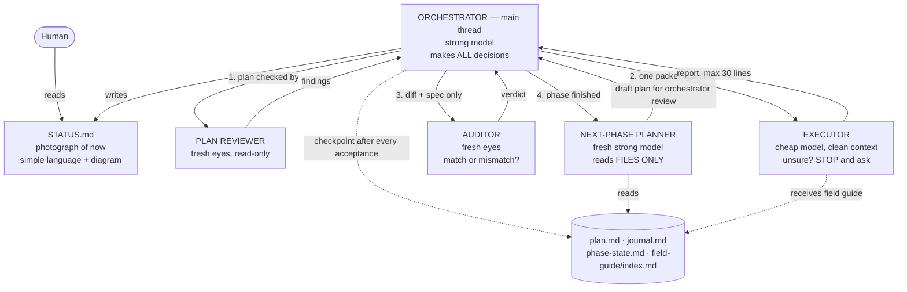
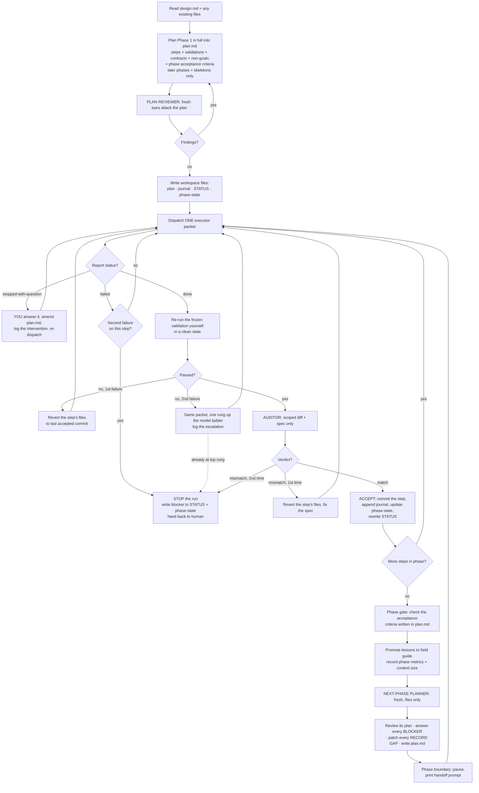

# oplan — orchestrated planning and execution

## 1. What this is, in one paragraph

You are the **orchestrator**: the main thread, running on a strong model. You do all the
thinking — you plan, you decide, you accept or reject work. You do almost none of the typing.
The typing is handed to **workers**: subagents on cheap models, each born with an empty head,
each given exactly one clearly-written job. Every result is checked twice: once by a machine
(a validation command you froze before the work started) and once by a **fresh pair of eyes**
(an auditor subagent that sees only the diff and the spec). Everything anyone needs to know
lives in files, not in anybody's head — so any agent, including you, can be killed and replaced
without losing the thread.

**Why this shape and not a swarm:** writes stay single-threaded. Extra agents contribute
*intelligence* (planning, review, audit), never parallel *actions*. Parallel disjoint-file
executors are a possible v0.2, and only if metrics prove speed is the bottleneck.

### When to use it

| Use oplan | Use plain plan-skill instead |
|---|---|
| 5+ steps, or 2+ phases | 1–3 steps you could do in one sitting |
| You want a written record that survives `/clear` | Throwaway exploration |
| Mistakes are expensive (real users, data, money) | Easily reversible edits |
| The work is repetitive enough that a cheap model can do it from a good spec | Every step needs top-tier judgement |

**Input:** oplan takes an optional frozen `design.md` — the WHAT. If the feature is greenfield,
produce that first (for example with the `grill-me` skill). Spec quality beats worker strength:
a great spec given to a cheap model beats a vague spec given to an expensive one.

## 2. The team



| Role | Who runs it | Context | Job |
|---|---|---|---|
| Orchestrator | main thread, PLANNER tier | long-lived, ages | Plans, decides everything, dispatches, re-runs validation, writes files, gates phases |
| Plan reviewer | subagent, CHECKER tier | fresh | Attacks the plan before any work starts — gaps, ambiguity, wrong order (packet defined in §10) |
| Executor | subagent, WORKER tier | fresh, clean | Does exactly one step from a packet; returns a capped report |
| Auditor | subagent, CHECKER tier | fresh | Sees ONLY diff + step spec; answers "does this match the spec, nothing more, nothing less?" |
| Next-phase planner | subagent, PLANNER tier | fresh | Plans Phase N+1 from the written record ONLY; the orchestrator reviews its plan |

The last row is deliberate symmetry: the orchestrator's plan gets fresh eyes, and the fresh
agent's plan gets the orchestrator's eyes. It is also a free test — if a fresh agent cannot plan
the next phase from the files alone, the written record has a hole, and that is a bug in the run.

## 3. The two lines that matter most

Everything else in this skill is scaffolding around these two rules.

**Rule 1 — the executor escalation rule.** This sentence goes verbatim into every executor packet:

> If you hit a question the spec doesn't answer, STOP and return the question. Never decide it yourself.

Why: two agents must never be able to decide the same question. If a worker quietly picks an
answer, you now have two different designs in one codebase and nobody knows. Weak models are
also bad at judging *when* to escalate, so escalation is never the worker's judgement call — it
is a mechanical rule: unanswered question → stop.

**Rule 2 — the report cap.** Executors return a fixed format, max 30 lines. You never read a
worker's full transcript. Your context is the scarcest resource in the whole system; a worker's
process is not information, only its result is.

## 4. Hard rules

1. **Single writer.** One executor at a time. No parallel writers in v0.1.
2. **No decision is ever deferred to execution time.** If, while writing a step, you notice a
   decision the spec doesn't answer — decide it now, in the plan, and write it down. Dispatching
   a step that contains an open question is a bug.
3. **The executor never self-certifies.** A step is accepted only when YOU re-run its frozen
   validation command in a clean state (§7), and the auditor returns a match.
4. **Crash-only.** If a fact exists only in your head and not in a file, that is a bug in the
   run. Fix it by writing the file, immediately. This is why the plan itself is a file (§5).
5. **Sequential phases.** Later phases exist as skeletons from the start; only the current phase
   is detailed. Phase N+1 is detailed only after Phase N execution is finished, when the facts
   are real instead of imagined.
6. **Escalation is yours, never the worker's.** See §7.
7. **STATUS.md has exactly one writer: you.**

## 5. Files — the shared memory

**Workspace:** create `.oplan/<run-name>/` at the repo root at the start of the run. All five
files live there. If a `design.md` exists, copy it in — the next-phase planner is told to read
`<workspace>/design.md` and must not depend on a path only you remember. If the skill itself is
not installed in the environment, also copy `SKILL.md` and `templates/` into `<workspace>/skill/`:
the record must be self-governing, or a fresh session cannot resume the run's own procedure.

| File | Job | Rule |
|---|---|---|
| `plan.md` | The plan: current phase in full, later phases as skeletons | The steps, their frozen validation commands, frozen contracts, non-goals, tiers, and the phase acceptance criteria. Written before the first dispatch; a step's spec is amended only by you, and every amendment is logged in the journal. |
| `journal.md` | History: everything that happened | Append-only. Allowed to grow. Raw input for the next-phase planner. |
| `STATUS.md` | A photograph of NOW, for the human | **Rewritten** every update, never appended. Simple language + a mermaid diagram. No stale lines. Line budget 60 lines (same soft-cap rule as §6). Orchestrator is the only writer. |
| `phase-state.md` | "Where are we" for agents | Updated at every step acceptance — this is the checkpoint. |
| `field-guide/index.md` | Curated lessons, injected into every executor and planner packet — **never** into an auditor packet (its blindness is the instrument, §7) | Line-budgeted (§6). Orchestrator promotes journal entries into it at phase boundaries. |

**Why `plan.md` is a file and not just your context:** every step spec, validation command and
contract you hold in your head is a fact that dies with you. The plan is the biggest such fact.
It is also what the auditor's spec excerpt and the next-phase planner's skeleton are copied from.

**`phase-state.md` must contain** (nothing more — it is a pointer, not a story):

```
CURRENT: phase <N> "<name>", next step <N>.<n>
PLAN: <workspace>/plan.md
ACCEPTED: <step id — commit hash> ... (one line each)
FROZEN CONTRACTS IN FORCE: <names, types, schemas, formats — the things nobody may change>
OPEN QUESTIONS: <question — who must answer it> (or "none")
BLOCKED: <what stopped the run, or "no">
```

**STATUS.md vs journal.md — the rule that prevents duplication:** if a fact is *history*, it
lives in the journal; if a fact is *current*, it lives in STATUS. A fact is never in both.

**What "photograph" means:** you do not edit STATUS.md line by line. You rewrite the whole file
from the current truth. A stale line in STATUS.md is worse than no STATUS.md, because the human
trusts it.

## 6. The field guide

`field-guide/index.md` is the small pile of lessons this project has learned, injected into every
executor and planner packet — so a brand-new worker knows the local gotchas without reading the
whole history. It never goes to the auditor.

- **Budget: 40 lines.** This is a *soft* cap with a price: you may exceed it only if you write a
  one-line justification into `journal.md` (for example: `field guide at 46/40 because: the
  migration gotcha cannot be compressed without losing the command`).
- The cap's real job is not saving tokens (40 lines is pennies). Its job is **eviction pressure**:
  when the file is full, adding a lesson forces the question "which old lesson is worth less than
  this one?" That question *is* the curation.
- Promote lessons at phase boundaries, not continuously. A "lesson" is something a future agent
  would get wrong without being told — not a summary of what happened.
- Record field-guide fullness (`N/40`) and any overflow in the phase-boundary metrics (§12).

## 7. Verification — three layers, a ladder, and a stop

**Layer 1 — the frozen mechanical gate.** Every step has a validation command, written by the
planner *at plan time*, before any executor exists, and then frozen. The executor may run it
while iterating, but acceptance happens only when the ORCHESTRATOR re-runs it. A validation
command that cannot be run mechanically (a "looks good") is not a validation command; rewrite it
until it is.

> **"Clean state" means:** a fresh shell you control, run against the executor's changes, with any
> build/test cache the executor may have warmed removed. It does NOT mean a clean git tree — the
> executor's uncommitted changes are exactly what you are validating.

**Layer 2 — the auditor (output lens).** A fresh subagent receives ONLY the diff and the step
spec. Its question is narrow on purpose: *does the work match the spec — nothing more, nothing
less?* Both halves matter — extra unrequested work is a finding, exactly like missing work.
v0.1 has one auditor lens; a second codebase-consistency lens is a v0.2 idea.

> **The audited diff is scoped, not the whole tree:**
> `git diff <last accepted commit> -- <exactly the files in the step's list>`.
> Without the pathspec the auditor sees your own writes to the workspace files and reports them
> as boundary violations by an executor that never touched them. And for files the step CREATES,
> run `git add -N <file>` first — a brand-new untracked file otherwise produces an EMPTY diff,
> and the auditor will truthfully report that the executor did nothing.

**Layer 3 — the phase gate.** Phase acceptance criteria are written during planning, before any
executor exists, and live in `plan.md`. They are the run's held-out test: work is not allowed to
redefine what "done" means after the fact.

**The escalation ladder — driven by you, never by the worker.** Escalation moves one rung up the
**model** ladder in §8, not up the tier list (under the v0.1 binding, WORKER and CHECKER are the
same model, so a tier-space reading would be a no-op). A step starts on its assigned tier. If its
validation fails twice, you re-dispatch **the same packet, unchanged**, one rung up, and log it
as `tier: WORKER (Opus, escalated)` — the role does not change, only the horsepower.

Do not rewrite the spec on the first escalation: if the same spec succeeds one rung up, the spec
was fine and the tier was wrong; if it fails again, the spec is the problem and needs your
attention. Log every escalation with the step id — escalations are the data that says where cheap
models can and cannot be trusted in this project.

**Where the loop ends (there is always a terminal state).** Re-dispatching is not unbounded. STOP
the run, write the blocker into `STATUS.md` and `phase-state.md`, and hand back to the human when
any of these happens:

- validation still fails after an escalation to the **top rung** of the ladder;
- the **same step** comes back `mismatch` from the auditor **twice**;
- an executor returns `STATUS: failed` twice on the same step;
- a report arrives that does not follow the required format twice in a row (log the malformed
  report, re-dispatch once with the format restated, then stop).

A stopped run is a success of the machinery, not a failure of it: the alternative is burning
tokens in a loop nobody is watching.

## 8. Tiers and model binding

The skill speaks in **tiers**, so it ports to any harness. Bind tiers to concrete models once,
in this table, and change nothing else when moving between tools.

| Tier | Meaning | Used by |
|---|---|---|
| PLANNER | strong: design decisions, long-horizon coherence | orchestrator, next-phase planner |
| CHECKER | middle: careful comparison against a spec | plan reviewer, auditor |
| WORKER | cheap: pattern-following execution from a complete spec | executor |

**Claude Code binding (v0.1 default):**

| Role | Model |
|---|---|
| Orchestrator | Opus |
| Next-phase planner | Opus |
| Plan reviewer | Sonnet |
| Auditor | Sonnet |
| Executor | Sonnet (Haiku only after metrics show a class of steps is safe for it) |
| **Escalation ladder** | **Haiku < Sonnet < Opus < Fable** |

Fable sits at the top rung: reachable by escalation, or chosen deliberately for a phase whose
planning is genuinely hard. It is roughly twice Opus's cost, so it is not a default — the honest
metric is cost per completed task, not cost per token.

**Porting to another harness** (Codex, etc.): replace this section's two tables with that
harness's models and its own ladder ordering. Everything outside this section is written in
tier names and needs no edit.

## 9. The executor packet

Every dispatch is built from `templates/executor-packet.md` and contains exactly these seven
things — no more (context is expensive), no less (a missing piece forces a worker to guess):

1. **The spec-complete step:** goal, files it may touch, commands, and the frozen validation command.
2. **Relevant frozen contracts only** — the excerpt this step needs, not the whole plan.
3. **The write-set boundary and non-goals:** only these files; no refactoring; no fixing adjacent
   code; never touch tests or validation commands. (Exception: if the step's job IS writing tests,
   say so — and have a different agent review those tests.)
4. **The escalation rule**, verbatim (§3).
5. **`field-guide/index.md` contents.**
6. **Budgets:** retry limit, token/time bounds.
7. **The required report format**, verbatim:

```
STATUS: done | failed | stopped-with-question
DID: <=5 lines — what changed, per file
VALIDATION: exact command run + last lines of output
SURPRISES: <=3 lines, or "none"
DEVIATIONS: <=3 lines, or "none"
QUESTION: only if stopped — the exact decision needed
METRICS: retries=N, validation_first_try=yes|no
(hard cap: 30 lines total)
```

A malformed report is itself a finding: log it, re-dispatch once with the format restated, and
stop the run if the second one is malformed too (§7).

## 10. The orchestrator's procedure



In words:

1. **Plan Phase 1 completely, into `plan.md`.** Every step gets: goal, exact files, commands,
   frozen validation command, the frozen contracts it needs, its non-goals, its budgets, and its
   tier — that is exactly the set of slots the executor packet requires, so a step is not finished
   being planned until all of them are filled. The phase also gets **mechanical acceptance
   criteria**, written now, before any executor exists. Later phases get skeletons only.
2. **Send the plan to a fresh plan reviewer** before any execution (packet below). Fix what it finds.
3. **Write the workspace files** (`plan.md`, `journal.md`, `STATUS.md`, `phase-state.md`) before
   dispatching anything. If you crash here, the run must still be recoverable.
4. **Dispatch one packet.** Wait. Read only the report.
5. **If the worker stopped with a question:** answer it yourself, amend the step spec in `plan.md`
   so the answer is now written down, log it as an intervention, re-dispatch.
6. **Re-run the frozen validation yourself,** in a clean state (§7). The worker's word is not
   evidence.
7. **On failure: revert first, then retry.** Restore the step's files to the last accepted commit
   (`git checkout <last accepted commit> -- <the step's file list>`) before every re-dispatch — a
   fresh executor is told it has no history, so it cannot know what a previous attempt left behind.
   Second failure → same packet, one rung up (§7), and log the escalation.
8. **Send the scoped diff + spec to the auditor** (§7, Layer 2). Mismatch → revert, fix the spec,
   re-dispatch once; a second mismatch on the same step stops the run. `match` with
   `CONFIDENCE: low` → supply the missing evidence (an extra file, a second lens) and re-audit
   once; if it is still low, accept and log it as a risk in the journal.
9. **Accept:** commit the step's files (`step <phase>.<n>: <title>`), append to the journal,
   update `phase-state.md` (this is your checkpoint), rewrite `STATUS.md`.
10. **At the phase gate:** check the acceptance criteria written in `plan.md` before the phase
    started, promote field-guide lessons, record phase metrics including your own context size,
    and rewrite `STATUS.md` — a phase close is an update like any other, and it is exactly where
    the first smoke run left STATUS stale.
11. **Have a fresh planner plan Phase N+1** from files alone, then review its plan yourself.
    Its `BLOCKERS` and `RECORD GAPS` are not commentary: **answer every blocker in writing and
    patch the file each record gap names**, before dispatching the first step of the new phase.
    Write the resulting plan into `plan.md`.
12. **Pause at the phase boundary** (§11) and print the handoff prompt.

### The plan reviewer packet (fill in and send; CHECKER tier)

> You are reviewing a plan before any of it is executed. Fresh eyes are the whole point — you did
> not write it and you have no history with it.
>
> **The plan:** {{paste plan.md — current phase in full}}
> **The design it must satisfy:** {{design.md excerpt, or "none — the brief is the plan's goal section"}}
> **Local lessons:** {{field-guide/index.md}}
>
> Each step will be executed by a cheap model in a clean context that sees only that step. So hunt
> for the things that will break under those conditions:
> 1. **Undecided decisions** — anything a worker would have to guess: an unspecified name, format,
>    strategy, or default. These are the expensive defects; list them first.
> 2. **Unrunnable validation** — any validation that is not a mechanical pass/fail command.
> 3. **Wrong order or hidden dependency** — a step that needs something a later step produces.
> 4. **Fuzzy boundaries** — a step whose file list cannot possibly be enough for its goal, or
>    whose goal invites work outside the list.
> 5. **Missing steps** — setup, dependencies, directories, migrations that nothing creates.
> 6. **Acceptance criteria** that do not actually test the phase's goal.
>
> Return exactly:
> ```
> VERDICT: ship | fix-first
> FINDINGS:
>   - [undecided|validation|order|boundary|missing|acceptance] step <id> — <what is wrong, one line>
>   - ... (or "none")
> (hard cap: 25 lines)
> ```
> `fix-first` if there is even one `undecided` finding — those are exactly what this gate exists
> to catch.

## 11. Context and phase boundaries

Facts to design around: subagents are born fresh and die at task end, so they are immune to
context rot — but they cannot clear themselves, and neither can you. `/clear` is a human command.
Auto-compaction exists but is lossy. Therefore:

- Short reports (§3) plus a checkpoint after every acceptance keep your context growing slowly,
  and cap the worst case: if you die, the maximum loss is the current step.
- **Default at every phase boundary: pause.** Print the handoff prompt below; the human presses
  `/clear` and pastes it. One keystroke, and a fresh session resumes from files alone.
- **Continuous mode (human opt-in only):** if the human says at run start "run all phases without
  pausing", skip the pause — plan Phase N+1 (fresh planner as always), review it, write it to
  `plan.md`, and keep executing in this session. What you give up is not planning freshness (the
  planner subagent is fresh either way) — it is YOUR OWN context hygiene: your head keeps filling
  and nobody can empty it, because `/clear` is a human command and subagents cannot run your loop
  for you (a subagent cannot dispatch subagents — only the main thread hires). So: fine for short
  runs (~3 phases or fewer); for longer runs, tell the human you recommend a pause and let them
  overrule. Never enter continuous mode on your own initiative.
- **Record your accumulated token count in the journal at each phase boundary.** After a few real
  runs, that data decides whether the phase-boundary clear stays "recommended" or becomes
  "optional" — do not guess it now.

```text
--- HANDOFF PROMPT (paste into fresh session) ---
Continue run from: <workspace>/phase-state.md
Read first: phase-state.md, then plan.md, then journal.md (last phase), then field-guide/index.md, then design.md
Resume at: Phase <N+1> — plan it first (fresh planner), then execute
Execution mode: <step-by-step|autonomous>
Model: <PLANNER tier model>
Context: fresh session recommended — previous phase filled the orchestrator's context
Before executing:
1. Read the files above fully.
2. Check git status.
3. Re-acknowledge the frozen contracts listed in phase-state.md before writing anything.
4. Plan Phase <N+1> in full (fresh next-phase planner, files only), review that plan, THEN execute.
--- END HANDOFF PROMPT ---
```

**The test that this actually works** is the resume drill in the project's `tests/fire-drill.md`:
kill the orchestrator mid-phase and resume from files alone. If that fails, the file discipline is
broken, not the drill.

## 12. Metrics — what every run collects

Append to `journal.md` after every accepted step:

```
STEP <phase>.<n> <title>
  tier: <WORKER|CHECKER|PLANNER> (<model>[, escalated])
  did: <the accepted report's DID lines, verbatim>
  surprises: <the report's SURPRISES, verbatim>
  deviations: <the report's DEVIATIONS, verbatim>
  validation_first_try: yes|no
  retries: <N>
  escalations: <N> (<from model> -> <to model>, reason)
  tokens: worker=<N>, checker=<N>, orchestrator_delta=<N>
  interventions: <N> (<reason: unanswered-question|bad-spec|trap|other>)
  commit: <hash>
  accepted: <ISO timestamp>
```

The `did` / `surprises` / `deviations` lines are what make the journal "everything that happened"
rather than a scoreboard — they are the next-phase planner's only account of what was built and
what bit us, and the raw material the field guide is curated from.

And at every phase boundary:

```
PHASE <N> CLOSED
  steps: <N>, first-try passes: <N>/<N>
  escalations: <N> (steps: <list>)
  interventions: <N>
  cost: worker=$<X>, checker=$<X>, planner=$<X>, total=$<X>
  orchestrator_context: <N> tokens
  field_guide: <N>/40 lines (<overflow justification, or "within budget">)
```

**Where the numbers come from:** token and cost figures come from the harness's own usage readout
for each subagent result, and your own context size from the harness's context/cost display (in
Claude Code: `/context` and `/cost`). If the harness cannot report a number, write `unavailable`.
Never estimate a metric — a made-up number is worse than a missing one, because the kill decision
below is made from these figures. Compute every total with a command (`awk`, `python`), never in
your head — nothing in this machinery re-checks your arithmetic, and the first smoke run mis-added
a six-number sum.

The six numbers that matter (and why): first-try pass rate and retries say whether specs are
good enough; escalations say where you misjudged difficulty; cost split by model says whether
the cheap-worker idea is actually paying; interventions say how much human time this really
costs; orchestrator context size decides the `/clear` policy.

**The honesty clause:** these numbers exist to be compared against doing the same work with a
plain single-agent plan. If oplan does not show fewer bugs reaching the human, fewer
interventions, or meaningfully lower cost, shrink it to the parts that earned their keep or drop
it. Machinery that cannot show its value is fluff.

## 13. Files in this skill

| File | Use |
|---|---|
| `SKILL.md` | This file — the whole procedure, including the plan-reviewer packet (§10) |
| `templates/executor-packet.md` | Fill in and send to a worker |
| `templates/auditor.md` | Fill in and send to the fresh-eyes checker |
| `templates/next-phase-planner.md` | Fill in and send to the fresh planner at a phase boundary |

The test ladder (paper test, smoke test, fire drill) lives in the development project's `tests/`
folder, not inside the installed skill.
